# Trabajo Práctico — Procesamiento de Imágenes Médicas (PET + MRI Cerebral)

**Materia:** Procesamiento de Imágenes I  
**Integrantes:** Mateo Hernandez, Felipe Lucero  
**Repositorio en GitHub:** [github.com/mateoHernandez123/Trabajo-Practico-PET-Morfologia](https://github.com/mateoHernandez123/Trabajo-Practico-PET-Morfologia)

Este trabajo implementa dos pipelines de procesamiento de imágenes médicas:

1. **PET de cuerpo completo** (`segment_pet.py`): segmentación con Region Growing y K-Means sobre imágenes PET.
2. **MRI cerebral — detección de tumores** (`segment_brain_mri.py`): segmentación con **K-Means**, **SuperPixel SLIC + Clustering** y **Region Growing** sobre el dataset [Brain Tumor MRI Dataset](https://www.kaggle.com/datasets/masoudnickparvar/brain-tumor-mri-dataset) (7,023 imágenes: glioma, meningioma, pituitary, no tumor).

Ambos pipelines comparten: preprocesamiento, detección de bordes (Canny), **post-procesamiento morfológico con erosión y dilatación explícitas**, **filtro por forma**, extracción de features (área, perímetro, centroide, ejes, orientación, excentricidad, compacidad, intensidad media), generación de máscara binaria y recortes individuales por tumor.

## Cómo ejecutar

```bash
python3 -m venv .venv
source .venv/bin/activate
pip install -r requirements.txt

# PET cuerpo completo
python3 segment_pet.py

# MRI cerebral — una imagen
python3 segment_brain_mri.py dataset/Testing/glioma/Te-gl_0010.jpg

# MRI cerebral — batch (15 imágenes)
python3 segment_brain_mri.py dataset/Testing/ --batch --max-images 15 --no-show
```

Instrucciones detalladas (venv, Windows/Linux, Git Bash): [docs/Readme.md](docs/Readme.md).  
Respuestas y justificaciones de la consigna: [docs/doc.md](docs/doc.md).

La carpeta `resultados/` se genera al ejecutar el script. La imagen de entrada debe estar en `imagenes/pet_cuerpo_completo.png` (ver [docs/Readme.md](docs/Readme.md) para usar otra ruta).

---

## Imagen de entrada

Imagen PET de cuerpo completo utilizada como escena de interés. Las zonas oscuras representan alta actividad metabólica (hot spots).

<p align="center">
  
</p>

**Uso en el código:** se carga en escala de grises desde `imagenes/pet_cuerpo_completo.png` y es la base del pipeline completo.

---

## Resultados visuales (qué muestra cada imagen y qué técnica justifica)

### 1. Bordes detectados (Canny)

<p align="center">
  
</p>

**Qué es:** bordes detectados con Canny (umbrales 40/120) sobre la imagen preprocesada, restringidos a la silueta del cuerpo.  
**Qué justifica:** visualizar los gradientes de intensidad presentes en la imagen; los bordes son más marcados en las zonas de transición entre tejido con captación y tejido normal.

### 2. Máscara binaria — Region Growing

<p align="center">
  
</p>

**Qué es:** máscara binaria obtenida por umbralización por percentil 90 + crecimiento de regiones (BFS con tolerancia 25) + post-procesamiento morfológico (erosión + dilatación + filtro por forma).  
**Qué justifica:** solo quedan los tumores. El cerebro y otros órganos con captación fisiológica fueron eliminados por la combinación de erosión fuerte (2 iteraciones) y filtro por forma.

### 3. Máscara binaria — K-Means

<p align="center">
  
</p>

**Qué es:** máscara binaria obtenida por K-Means (K=4 clusters) seleccionando el cluster más oscuro + post-procesamiento morfológico (erosión + dilatación + filtro por forma).  
**Qué justifica:** el filtro por forma descartó la enorme región del cerebro que K-Means capturaba, dejando solo las lesiones focales.

---

## Pipeline morfológico (erosión + dilatación + filtro por forma)

Tras la segmentación, se aplica un pipeline de morfología matemática con **operaciones explícitas** para aislar los tumores descartando captación fisiológica:

| Paso | Operación | Efecto |
|------|-----------|--------|
| 1 | **Erosión** (kernel 3×3, 2 iter) | Separa regiones débilmente conectadas, elimina ruido y blobs pequeños de captación fisiológica (ej. cerebro en Region Growing) |
| 2 | **Dilatación** (kernel 3×3, 3 iter) | Recupera bordes del tumor; la asimetría (3 iter vs 2) captura píxeles de borde con menor captación |
| 3 | **Cierre** (kernel 3×3, 1 iter) | Sella huecos internos residuales |
| 4 | **Filtro por área** (≥ 15 px) | Descarta artefactos pequeños |
| 5 | **Filtro por forma** | Descarta componentes con perfil de órgano (grandes + compactos + sólidos) |

### Filtro por forma — discriminación órgano vs tumor

Los órganos (cerebro, hígado) presentan captación fisiológica normal en PET. Para distinguirlos de tumores **sin depender de la posición**, se analizan métricas de forma:

| Métrica | Órganos | Tumores |
|---------|---------|---------|
| **Compacidad** (4πA/P²) | Alta (> 0.40): forma redondeada | Variable: bordes irregulares |
| **Solidez** (A/A_convex_hull) | Alta (> 0.65): contorno suave | Variable: más concavidades |
| **Área** | Grande (> 350 px) | Menor |

Un componente se descarta como órgano si cumple **todas** las condiciones. Esto es independiente de la posición: funciona sin importar dónde estén los tumores en el cuerpo.

### Pasos morfológicos — Region Growing

<p align="center">
  
  
  
  
  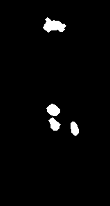
  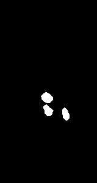
</p>

De izquierda a derecha: máscara cruda → erosión (elimina cerebro chico) → dilatación (recupera bordes) → cierre → filtro por área → **filtro por forma** (descarta órganos).

### Pasos morfológicos — K-Means

<p align="center">
  
  
  
  
  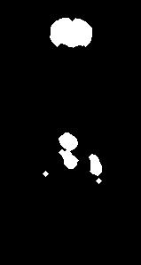
  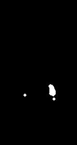
</p>

De izquierda a derecha: máscara cruda (cerebro enorme) → erosión → dilatación → cierre → filtro por área → **filtro por forma** (cerebro descartado, solo tumores).

---

### 4. Caracterización — Region Growing

<p align="center">
  
</p>

**Qué es:** imagen original con bounding boxes (verde), centroides (magenta) e IDs (azul) de cada tumor detectado por Region Growing.  
**Qué justifica:** los bounding boxes solo marcan lesiones en la zona de cadera y piernas. El cerebro no aparece porque fue descartado por el pipeline morfológico.

### 5. Caracterización — K-Means

<p align="center">
  
</p>

**Qué es:** imagen original con bounding boxes, centroides e IDs de cada tumor detectado por K-Means.  
**Qué justifica:** solo se marcan las lesiones focales. La captación fisiológica del cerebro fue eliminada.

### 6. Comparativa de métodos

<p align="center">
  
</p>

**Qué es:** panel comparativo que muestra el pipeline completo de ambos métodos side-by-side.  
**Qué justifica:** permite evaluar las diferencias entre Region Growing y K-Means en cuanto a la cantidad, tamaño y ubicación de las lesiones detectadas.

### 7. Recortes individuales — Region Growing

<p align="center">
  
</p>

**Qué es:** galería de recortes donde cada tumor aparece aislado sobre fondo blanco.  
**Qué justifica:** cada crop muestra exclusivamente los píxeles de la lesión, sin incluir cerebro ni otros órganos.

### 8. Recortes individuales — K-Means

<p align="center">
  
</p>

**Qué es:** galería de recortes de los tumores detectados por K-Means.  
**Qué justifica:** misma técnica de extracción, distinto método de segmentación.

---

## Features detectadas

### Region Growing

| ID  | Área | Perímetro | Centroide (x, y) | BBox (x, y, w, h)  | Ejes M/m      | Orient.° | Excent. | Compact. | I. media |
| --- | ---- | --------- | ---------------- | ------------------ | ------------- | -------- | ------- | -------- | -------- |
| 1   | 249  | 56.77     | (76.6, 158.9)    | (67, 150, 20, 18)  | 19.22 / 15.26 | 120.14   | 0.608   | 0.971    | 18.5     |
| 2   | 203  | 54.77     | (78.2, 179.6)    | (70, 170, 18, 19)  | 19.37 / 12.66 | 147.41   | 0.757   | 0.850    | 15.8     |
| 3   | 185  | 52.28     | (107.2, 185.7)   | (102, 175, 12, 22) | 20.61 / 10.23 | 165.32   | 0.868   | 0.850    | 21.1     |

### K-Means

| ID  | Área | Perímetro | Centroide (x, y) | BBox (x, y, w, h)  | Ejes M/m      | Orient.° | Excent. | Compact. | I. media |
| --- | ---- | --------- | ---------------- | ------------------ | ------------- | -------- | ------- | -------- | -------- |
| 1   | 256  | 64.53     | (107.1, 185.4)   | (100, 173, 15, 25) | 24.91 / 12.39 | 166.38   | 0.868   | 0.773    | 42.5     |
| 2   | 25   | 16.97     | (51.0, 195.0)    | (48, 192, 7, 7)    | 5.25 / 5.25   | 0.00     | 0.000   | 1.091    | 48.2     |
| 3   | 25   | 16.97     | (111.0, 203.0)   | (108, 200, 7, 7)   | 5.25 / 5.25   | 0.00     | 0.000   | 1.091    | 52.1     |

### Componentes descartados por filtro por forma

| Método | Área (px) | Compacidad | Solidez | Motivo |
|--------|-----------|------------|---------|--------|
| Region Growing | 438 | 0.584 | 0.902 | Cerebro (grande + compacto + sólido) |
| K-Means | 1296 | 0.755 | 0.976 | Cerebro (grande + compacto + sólido) |
| K-Means | 595 | 0.459 | 0.849 | Órgano (grande + compacto + sólido) |

---

---

## MRI Cerebral — Detección de Tumores (`segment_brain_mri.py`)

### Dataset

[Brain Tumor MRI Dataset](https://www.kaggle.com/datasets/masoudnickparvar/brain-tumor-mri-dataset) — 7,023 imágenes en 4 categorías:

| Categoría   | Training | Testing | Total |
|-------------|----------|---------|-------|
| Glioma      | 1,321    | 300     | 1,621 |
| Meningioma  | 1,339    | 306     | 1,645 |
| Pituitary   | 1,457    | 300     | 1,757 |
| No tumor    | 1,595    | 405     | 2,000 |

Descarga automática desde [Zenodo](https://zenodo.org/records/12735702):

```bash
mkdir -p dataset
wget -O dataset/brain-tumor-mri-dataset.zip \
  "https://zenodo.org/records/12735702/files/brain-tumor-mri-dataset.zip?download=1"
cd dataset && unzip brain-tumor-mri-dataset.zip
```

### Pipeline de procesamiento

```
Imagen MRI → CLAHE + Gaussiano → Máscara cerebral (Otsu) → Canny (bordes)
         ↓
    ┌────┴─────────────────┬────────────────────────┐
    │                      │                         │
 K-Means            SuperPixel SLIC          Region Growing
 (K=4, cluster     (200 SP → features →      (percentil 85%
  más brillante)    K-Means ponderado)        + BFS tol=20)
    │                      │                         │
    └──────────┬───────────┴─────────────────────────┘
               ↓
    Post-procesamiento morfológico:
      Erosión → Dilatación → Cierre → Filtro área → Filtro forma
               ↓
    Caracterización (features) + Crops + CSV
```

### Tres métodos de segmentación

| Método | Técnica | Detalle |
|--------|---------|---------|
| **K-Means** | Clustering directo en intensidades | K=4 clusters; selecciona el más brillante (tumor en MRI con contraste) |
| **SuperPixel (SLIC) + Clustering** | SLIC genera ~200 superpíxeles → features por SP (intensidad, std, gradiente Sobel, posición) → K-Means ponderado (6 clusters) | Detecta regiones tumorales con intensidad > media cerebral + 0.8·σ, respetando bordes naturales |
| **Region Growing** | Semillas desde percentil 85% de intensidad dentro del cerebro → BFS 8-vecinos con tolerancia 20 | Crecimiento adaptativo desde las zonas más brillantes |

---

### Resultados visuales — Glioma (Te-gl_0010)

#### Imagen MRI original

<p align="center">
  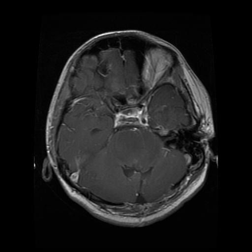
</p>

**Qué es:** imagen MRI cerebral con glioma (tumor difuso de alto grado).

#### Bordes detectados (Canny)

<p align="center">
  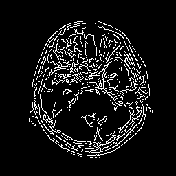
</p>

**Qué es:** bordes detectados con Canny (30/100) sobre la imagen mejorada con CLAHE, restringidos a la máscara cerebral.

#### Caracterización — K-Means (6 tumores detectados)

<p align="center">
  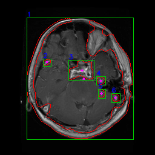
</p>

**Qué es:** imagen con bounding boxes (verde), centroides (magenta) e IDs (azul) de los **6 tumores** detectados por K-Means (K=4, cluster más brillante). Área total tumoral: **9,167 px**.

#### Máscara binaria — K-Means

<p align="center">
  
</p>

#### Clusters K-Means

<p align="center">
  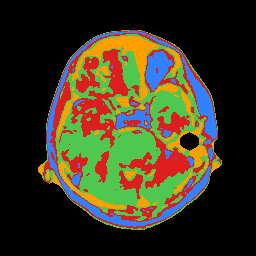
</p>

**Qué es:** visualización de los 4 clusters de intensidad. El cluster más brillante (rojo) corresponde a las regiones tumorales.

#### Caracterización — SuperPixel SLIC + Clustering (5 tumores detectados)

<p align="center">
  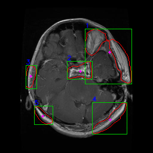
</p>

**Qué es:** **5 tumores** detectados agrupando ~200 superpíxeles SLIC por features (intensidad, gradiente, posición) con K-Means ponderado. Área total tumoral: **5,542 px**.

#### SuperPixel SLIC — Fronteras

<p align="center">
  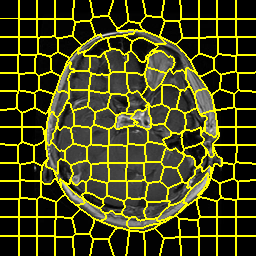
</p>

**Qué es:** los ~200 superpíxeles generados por SLIC. Cada celda agrupa píxeles con intensidad y posición similares, respetando los bordes naturales del cerebro y el tumor.

#### Máscara binaria — SuperPixel

<p align="center">
  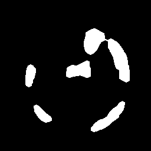
</p>

#### Caracterización — Region Growing (3 tumores detectados)

<p align="center">
  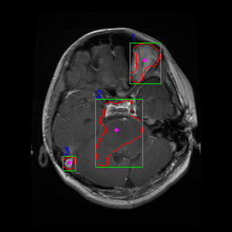
</p>

**Qué es:** **3 tumores** detectados por crecimiento de regiones desde semillas en el percentil 85% de intensidad. Área total tumoral: **3,225 px**.

#### Máscara binaria — Region Growing

<p align="center">
  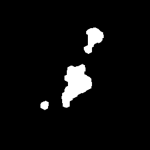
</p>

#### Pipeline morfológico — K-Means (Glioma)

<p align="center">
  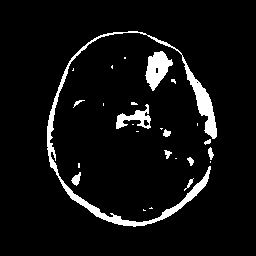
  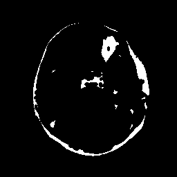
  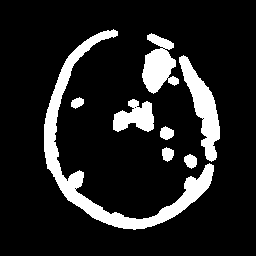
  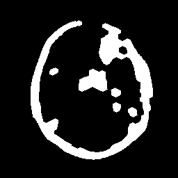
  
  
</p>

De izquierda a derecha: máscara cruda → erosión → dilatación → cierre → filtro por área → **filtro por forma** (descarta regiones no tumorales).

---

### Resultados visuales — Meningioma (Te-me_0010)

#### Imagen MRI original

<p align="center">
  
</p>

**Qué es:** imagen MRI cerebral con meningioma (tumor de las meninges, generalmente bien delimitado).

#### Caracterización — K-Means (4 tumores detectados)

<p align="center">
  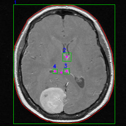
</p>

**Qué es:** **4 tumores** detectados por K-Means. Área total tumoral: **10,573 px**. El meningioma se caracteriza por una región grande y bien definida (tumor #1, 10,240 px).

#### Máscara binaria — K-Means

<p align="center">
  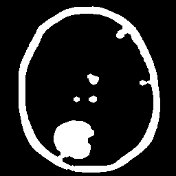
</p>

#### Clusters K-Means

<p align="center">
  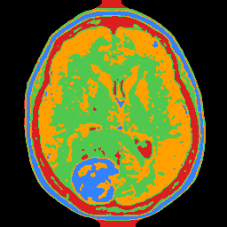
</p>

#### Caracterización — SuperPixel SLIC + Clustering (3 tumores detectados)

<p align="center">
  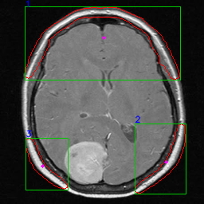
</p>

**Qué es:** **3 tumores** detectados por SuperPixel + Clustering. Área total: **6,207 px**. El método agrupa superpíxeles de alta intensidad respetando los bordes del tumor.

#### SuperPixel SLIC — Fronteras

<p align="center">
  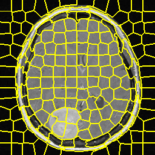
</p>

#### Máscara binaria — SuperPixel

<p align="center">
  
</p>

#### Caracterización — Region Growing (0 tumores detectados)

<p align="center">
  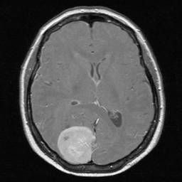
</p>

**Qué es:** Region Growing creció una región enorme (28,578 px) que fue descartada por el filtro por forma (compacidad=0.781, solidez=0.974). En este caso, el filtro fue demasiado agresivo porque el meningioma es grande, compacto y sólido — similar al perfil de un órgano sano.

#### Pipeline morfológico — SuperPixel (Meningioma)

<p align="center">
  
  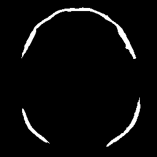
  
  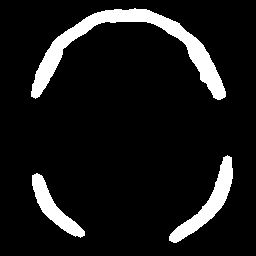
  
  
</p>

De izquierda a derecha: máscara cruda → erosión → dilatación → cierre → filtro por área → **filtro por forma**.

---

### Resultados visuales — Pituitary (Te-pi_0010)

#### Imagen MRI original

<p align="center">
  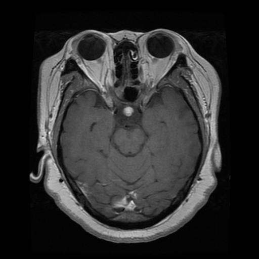
</p>

**Qué es:** imagen MRI cerebral con tumor pituitario (adenoma hipofisario, zona central inferior del cerebro).

#### Caracterización — K-Means (2 tumores detectados)

<p align="center">
  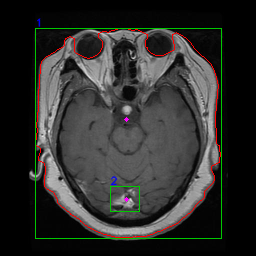
</p>

**Qué es:** **2 tumores** detectados por K-Means. Área total tumoral: **13,469 px**. K-Means agrupa el tumor pituitario como una sola región grande.

#### Máscara binaria — K-Means

<p align="center">
  
</p>

#### Caracterización — SuperPixel SLIC + Clustering (9 tumores detectados)

<p align="center">
  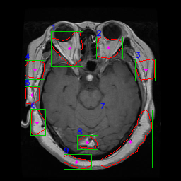
</p>

**Qué es:** **9 tumores** detectados por SuperPixel + Clustering. Área total: **7,445 px**. El método segmenta la región tumoral en múltiples subregiones siguiendo las variaciones de intensidad dentro del tumor.

#### SuperPixel SLIC — Fronteras

<p align="center">
  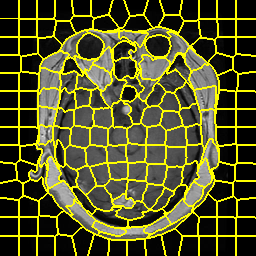
</p>

#### Máscara binaria — SuperPixel

<p align="center">
  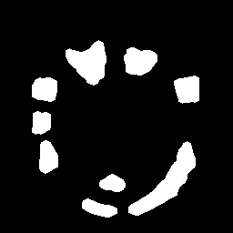
</p>

#### Caracterización — Region Growing (3 tumores detectados)

<p align="center">
  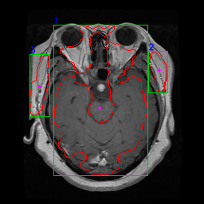
</p>

**Qué es:** **3 tumores** detectados por Region Growing. Área total: **14,494 px**. El crecimiento de regiones captura el tumor pituitario central y regiones laterales de alta intensidad.

#### Máscara binaria — Region Growing

<p align="center">
  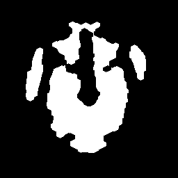
</p>

#### Pipeline morfológico — K-Means (Pituitary)

<p align="center">
  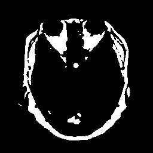
  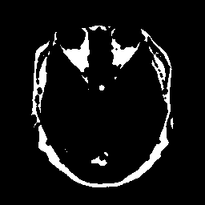
  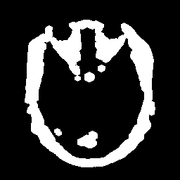
  
  
  
</p>

De izquierda a derecha: máscara cruda → erosión → dilatación → cierre → filtro por área → **filtro por forma**.

---

### Features detectadas — MRI Cerebral

#### Glioma (Te-gl_0010) — K-Means (6 tumores)

| ID | Área | Perímetro | Centroide (x, y) | BBox (x, y, w, h) | Ejes M/m | Excent. | Compact. | I. media |
|----|------|-----------|-------------------|--------------------|----------|---------|----------|----------|
| 1 | 7682 | 1246.9 | (137.7, 130.2) | (44, 29, 176, 201) | 188.5 / 162.4 | 0.508 | 0.062 | 84.4 |
| 2 | 105 | 38.4 | (76.9, 102.4) | (71, 97, 13, 12) | 13.3 / 8.7 | 0.757 | 0.896 | 77.5 |
| 3 | 958 | 142.0 | (134.6, 116.4) | (113, 99, 42, 33) | 43.5 / 31.3 | 0.694 | 0.597 | 91.8 |
| 4 | 146 | 45.2 | (166.1, 132.7) | (159, 126, 15, 14) | 14.0 / 11.9 | 0.532 | 0.897 | 68.7 |
| 5 | 134 | 43.0 | (167.3, 153.7) | (162, 147, 12, 15) | 13.3 / 11.5 | 0.501 | 0.912 | 69.7 |
| 6 | 142 | 44.6 | (190.4, 160.8) | (184, 154, 14, 15) | 14.1 / 11.4 | 0.590 | 0.896 | 59.4 |

#### Meningioma (Te-me_0010) — K-Means (4 tumores)

| ID | Área | Perímetro | Centroide (x, y) | BBox (x, y, w, h) | Ejes M/m | Excent. | Compact. | I. media |
|----|------|-----------|-------------------|--------------------|----------|---------|----------|----------|
| 1 | 10240 | 756.0 | (124.5, 147.4) | (27, 9, 206, 242) | 244.6 / 207.9 | 0.527 | 0.225 | 137.6 |
| 2 | 183 | 54.3 | (135.0, 114.7) | (127, 107, 17, 17) | 17.5 / 12.8 | 0.683 | 0.780 | 137.0 |
| 3 | 93 | 35.6 | (134.8, 143.9) | (129, 139, 12, 11) | 11.5 / 8.9 | 0.630 | 0.924 | 140.3 |
| 4 | 57 | 27.3 | (111.0, 144.0) | (107, 140, 9, 9) | 8.5 / 7.0 | 0.558 | 0.960 | 135.6 |

#### Pituitary (Te-pi_0010) — SuperPixel (9 tumores)

| ID | Área | Perímetro | Centroide (x, y) | BBox (x, y, w, h) | Ejes M/m | Excent. | Compact. | I. media |
|----|------|-----------|-------------------|--------------------|----------|---------|----------|----------|
| 1 | 1361 | 160.6 | (97.6, 68.1) | (72, 44, 45, 50) | 47.3 / 42.6 | 0.436 | 0.663 | 114.5 |
| 2 | 866 | 114.1 | (152.9, 66.8) | (136, 52, 37, 31) | 37.0 / 29.6 | 0.600 | 0.836 | 118.7 |
| 3 | 708 | 104.3 | (205.8, 97.8) | (191, 83, 28, 31) | 30.9 / 28.9 | 0.353 | 0.818 | 114.9 |
| 4 | 641 | 95.7 | (48.8, 97.7) | (35, 85, 28, 27) | 29.3 / 26.7 | 0.410 | 0.880 | 118.1 |
| 5 | 456 | 83.5 | (44.9, 134.3) | (35, 122, 21, 26) | 26.4 / 21.4 | 0.582 | 0.823 | 116.4 |
| 6 | 594 | 97.4 | (52.2, 172.7) | (43, 154, 21, 37) | 36.4 / 20.7 | 0.823 | 0.788 | 130.7 |
| 7 | 1914 | 248.8 | (184.1, 199.9) | (141, 155, 74, 82) | 102.1 / 30.9 | 0.953 | 0.388 | 117.1 |
| 8 | 407 | 78.8 | (123.5, 201.3) | (109, 191, 29, 20) | 28.0 / 17.7 | 0.775 | 0.824 | 99.3 |
| 9 | 498 | 99.6 | (108.2, 228.8) | (90, 218, 39, 21) | 43.2 / 14.3 | 0.943 | 0.631 | 124.1 |

---

### Resumen de detección (35 imágenes procesadas)

#### Detección por categoría

| Categoría | Método | Tasa detección | Tumores/imagen (media) | Área media (px) |
|-----------|--------|---------------|----------------------|----------------|
| **Glioma** (15 img) | K-Means | 100% (15/15) | 4.3 | 7,962 |
| | SuperPixel | 100% (15/15) | 4.1 | 7,594 |
| | Region Growing | 73% (11/15) | 2.1 | 9,831 |
| **Meningioma** (10 img) | K-Means | 100% (10/10) | 5.0 | 16,951 |
| | SuperPixel | 90% (9/10) | 4.0 | 8,346 |
| | Region Growing | 100% (10/10) | 3.7 | 19,466 |
| **Pituitary** (10 img) | K-Means | 100% (10/10) | 4.9 | 14,012 |
| | SuperPixel | 100% (10/10) | 4.8 | 11,353 |
| | Region Growing | 90% (9/10) | 3.3 | 20,652 |

#### Totales

| Método | Tumores totales | Imágenes con detección |
|--------|----------------|----------------------|
| K-Means | 164 | 35/35 (100%) |
| SuperPixel (SLIC) | 149 | 34/35 (97%) |
| Region Growing | 102 | 30/35 (86%) |

### Uso

```bash
# Una sola imagen, los 3 métodos, con visualización:
python3 segment_brain_mri.py dataset/Testing/glioma/Te-gl_0010.jpg

# Solo SuperPixel:
python3 segment_brain_mri.py dataset/Testing/glioma/Te-gl_0010.jpg --method superpixel

# Batch de 10 imágenes de meningioma:
python3 segment_brain_mri.py dataset/Testing/meningioma/ --batch --max-images 10 --no-show

# Todo el testing (906 imágenes con tumor):
python3 segment_brain_mri.py dataset/Testing/ --batch --no-show
```

---

## Estructura del proyecto

| Ruta                         | Contenido                                                                                        |
| ---------------------------- | ------------------------------------------------------------------------------------------------ |
| `README.md`                  | Este archivo: resumen, figuras y estructura                                                      |
| `segment_pet.py`             | Pipeline PET: preprocesamiento, bordes, segmentación, morfología, filtro por forma, features, recortes |
| `segment_brain_mri.py`       | Pipeline MRI cerebral: CLAHE, SuperPixel SLIC, K-Means, Region Growing, detección de tumores     |
| `requirements.txt`           | Dependencias (numpy, opencv-python, matplotlib, scikit-image)                                    |
| `dataset/`                   | Brain Tumor MRI Dataset (descargar desde Zenodo, ver instrucciones arriba)                       |
| `imagenes/`                  | Carpeta de entrada PET; por defecto `pet_cuerpo_completo.png`                                    |
| `resultados/`                | Salidas del pipeline PET (PNG, CSV, recortes, pasos morfológicos)                                |
| `resultados_mri/`            | Salidas del pipeline MRI (generadas al ejecutar, gitignored)                                     |
| `resultados_mri_samples/`    | Ejemplos de resultados MRI commiteados (glioma, meningioma, pituitary) para visualizar en GitHub |
| `docs/Readme.md`             | Instalación, entorno virtual y salidas                                                           |
| `docs/doc.md`                | Informe / respuestas a la consigna                                                               |
| `.gitignore`                 | Excluye venv/, cachés, dataset/ y resultados_mri/                                                |

### Parámetros ajustables

**PET** (`segment_pet.py`): `HOT_PERCENTILE`, `REGION_GROW_TOLERANCE`, `KMEANS_K`, `MIN_LESION_AREA`, `ERODE_KERNEL/ITERATIONS`, `DILATE_KERNEL/ITERATIONS`, `ORGAN_MIN_AREA/COMPACTNESS/SOLIDITY`, `MORPH_KERNEL`, `CANNY_LOW/HIGH`, `CROP_PAD`.

**MRI** (`segment_brain_mri.py`): `SLIC_N_SEGMENTS`, `SLIC_COMPACTNESS`, `SLIC_SIGMA`, `KMEANS_K`, `HOT_PERCENTILE`, `REGION_GROW_TOLERANCE`, `MIN_LESION_AREA`, `ERODE_KERNEL/ITERATIONS`, `DILATE_KERNEL/ITERATIONS`, `ORGAN_MIN_AREA/COMPACTNESS/SOLIDITY`, `MORPH_KERNEL`, `CANNY_LOW/HIGH`, `TARGET_SIZE`.

---

## Clonar o actualizar desde GitHub

```bash
git clone git@github.com:mateoHernandez123/Trabajo-Practico-PET-Morfologia.git
cd Trabajo-Practico-PET-Morfologia
```
