# Trabajo Práctico — Extracción y Caracterización de Objetos en PET (con Morfología)

**Materia:** Procesamiento de Imágenes I  
**Integrantes:** Mateo Hernandez, Felipe Lucero  
**Repositorio en GitHub:** [github.com/mateoHernandez123/Trabajo-Practico-PET-Morfologia](https://github.com/mateoHernandez123/Trabajo-Practico-PET-Morfologia)

Este trabajo implementa un pipeline en Python: preprocesamiento (mediana + gaussiano), detección de bordes (Canny), segmentación con dos métodos intercambiables (Region Growing y K-Means), **post-procesamiento morfológico con erosión y dilatación explícitas** para aislar tumores con mayor precisión, extracción de features (área, perímetro, centroide, ejes, orientación, excentricidad, compacidad, intensidad media), generación de máscara binaria y recortes individuales por objeto.

## Cómo ejecutar

```bash
pip install -r requirements.txt
python3 segment_pet.py
```

Instrucciones detalladas (venv, Windows/Linux, Git Bash): [docs/Readme.md](docs/Readme.md).  
Respuestas y justificaciones de la consigna: [docs/doc.md](docs/doc.md).

La carpeta `resultados/` se genera al ejecutar el script. La imagen de entrada debe estar en `imagenes/pet_cuerpo_completo.png` (ver [docs/Readme.md](docs/Readme.md) para usar otra ruta).

---

## Imagen de entrada

Imagen PET de cuerpo completo utilizada como escena de interés. Las zonas oscuras representan alta actividad metabólica (hot spots).

<p align="center">
  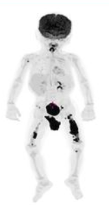
</p>

**Uso en el código:** se carga en escala de grises desde `imagenes/pet_cuerpo_completo.png` y es la base del pipeline completo.

---

## Resultados visuales (qué muestra cada imagen y qué técnica justifica)

### 1. Bordes detectados (Canny)

<p align="center">
  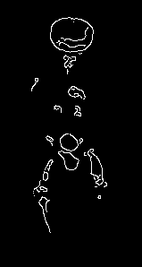
</p>

**Qué es:** bordes detectados con Canny (umbrales 40/120) sobre la imagen preprocesada, restringidos a la silueta del cuerpo.  
**Qué justifica:** visualizar los gradientes de intensidad presentes en la imagen; los bordes son más marcados en las zonas de transición entre tejido con captación y tejido normal.

### 2. Máscara binaria — Region Growing

<p align="center">
  
</p>

**Qué es:** máscara binaria obtenida por umbralización por percentil 90 + crecimiento de regiones (BFS con tolerancia 25) + post-procesamiento morfológico (erosión + dilatación).  
**Qué justifica:** la segmentación por Region Growing permite controlar la tolerancia de crecimiento. Las regiones blancas son los objetos de interés detectados (lesiones con alta captación).

### 3. Máscara binaria — K-Means

<p align="center">
  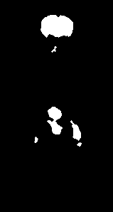
</p>

**Qué es:** máscara binaria obtenida por K-Means (K=4 clusters) seleccionando el cluster más oscuro (mayor captación metabólica) + post-procesamiento morfológico (erosión + dilatación).  
**Qué justifica:** la segmentación por clustering no supervisado separa automáticamente niveles de intensidad sin requerir umbrales manuales.

---

## Pipeline morfológico (erosión + dilatación)

Tras la segmentación, se aplica un pipeline de morfología matemática con **operaciones explícitas** para aislar los tumores con mayor precisión:

| Paso | Operación | Efecto |
|------|-----------|--------|
| 1 | **Erosión** (kernel 3×3, 1 iter) | Separa regiones débilmente conectadas, elimina ruido fino |
| 2 | **Dilatación** (kernel 3×3, 2 iter) | Recupera bordes del tumor; la asimetría intencional (2 iter vs 1) captura píxeles de borde con menor captación |
| 3 | **Cierre** (kernel 3×3, 1 iter) | Sella huecos internos residuales |
| 4 | **Filtro por área** (≥ 15 px) | Descarta artefactos pequeños |

### Pasos morfológicos — Region Growing

#### Máscara cruda (antes de morfología)

<p align="center">
  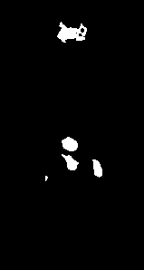
</p>

**Qué es:** la máscara directa de la segmentación por Region Growing, sin ningún procesamiento morfológico.

#### Después de erosión

<p align="center">
  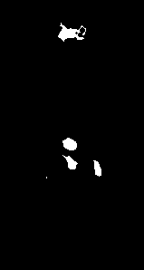
</p>

**Qué es:** resultado de aplicar `cv2.erode()` con kernel elíptico 3×3 (1 iteración).  
**Efecto:** se eliminan conexiones espurias de pocos píxeles entre regiones adyacentes y se remueve ruido fino. Los tumores reales se contraen ligeramente pero mantienen su estructura.

#### Después de dilatación

<p align="center">
  
</p>

**Qué es:** resultado de aplicar `cv2.dilate()` con kernel elíptico 3×3 (2 iteraciones) sobre la imagen erosionada.  
**Efecto:** recupera los bordes del tumor que la erosión removió y produce una **expansión neta de ~1 píxel** que captura píxeles de borde con menor captación metabólica.

#### Después de cierre

<p align="center">
  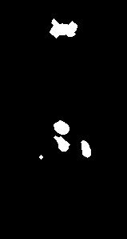
</p>

**Qué es:** resultado del cierre morfológico (`cv2.morphologyEx` con `MORPH_CLOSE`, 1 iteración).  
**Efecto:** sella huecos internos residuales dentro de los tumores.

#### Máscara final (filtrada por área)

<p align="center">
  
</p>

**Qué es:** máscara final tras descartar componentes conexos con área menor a 15 píxeles.  
**Efecto:** elimina artefactos pequeños que no corresponden a lesiones reales.

### Pasos morfológicos — K-Means

#### Máscara cruda (antes de morfología)

<p align="center">
  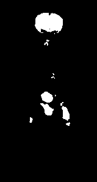
</p>

**Qué es:** la máscara directa de la segmentación por K-Means (cluster más oscuro), sin procesamiento morfológico.

#### Después de erosión

<p align="center">
  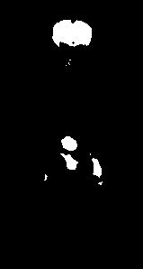
</p>

**Qué es:** resultado de aplicar `cv2.erode()` con kernel elíptico 3×3 (1 iteración).  
**Efecto:** elimina las conexiones finas y el ruido que K-Means introduce al asignar píxeles aislados al cluster más oscuro.

#### Después de dilatación

<p align="center">
  
</p>

**Qué es:** resultado de aplicar `cv2.dilate()` con kernel elíptico 3×3 (2 iteraciones) sobre la imagen erosionada.  
**Efecto:** recupera los bordes del tumor y expande ligeramente la región para capturar píxeles de transición.

#### Después de cierre

<p align="center">
  
</p>

**Qué es:** resultado del cierre morfológico (1 iteración).  
**Efecto:** sella huecos internos residuales en las lesiones detectadas.

#### Máscara final (filtrada por área)

<p align="center">
  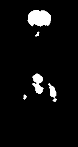
</p>

**Qué es:** máscara final tras el filtrado por área mínima (≥ 15 px).  
**Efecto:** solo quedan los componentes que corresponden a lesiones reales.

---

### 4. Caracterización — Region Growing

<p align="center">
  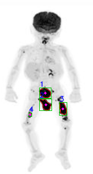
</p>

**Qué es:** imagen original con bounding boxes (verde), centroides (magenta) e IDs (azul) de cada objeto detectado por Region Growing.  
**Qué justifica:** visualización directa de las features geométricas sobre la imagen para validar que la segmentación captura las lesiones correctas.

### 5. Caracterización — K-Means

<p align="center">
  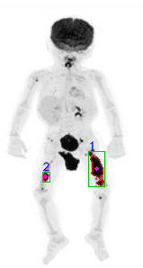
</p>

**Qué es:** imagen original con bounding boxes, centroides e IDs de cada objeto detectado por K-Means.  
**Qué justifica:** permite comparar visualmente qué lesiones captura cada método y verificar la correspondencia con la tabla de features.

### 6. Comparativa de métodos (con filtro anatómico)

<p align="center">
  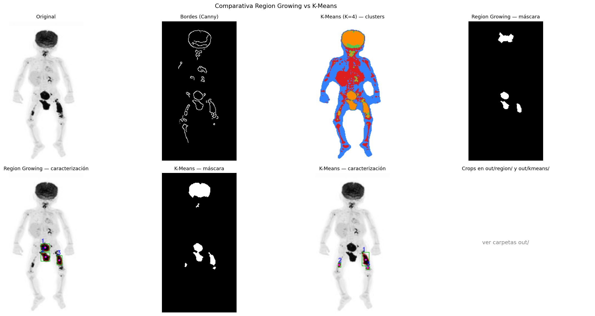
</p>

**Qué es:** panel comparativo que muestra el pipeline completo de ambos métodos side-by-side: imagen original, bordes, clusters K-Means, máscaras y caracterizaciones.  
**Qué justifica:** permite evaluar en un solo vistazo las diferencias entre Region Growing y K-Means en cuanto a la cantidad, tamaño y ubicación de las lesiones detectadas.

### 7. Recortes individuales — Region Growing

<p align="center">
  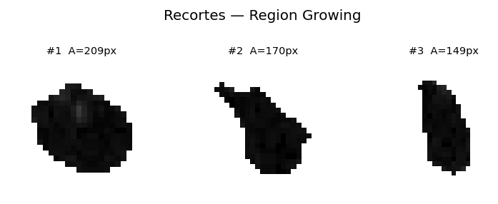
</p>

**Qué es:** galería de recortes donde cada objeto aparece aislado sobre fondo blanco, extraído de la imagen original usando la máscara del componente conexo correspondiente.  
**Qué justifica:** la consigna pide generar, a partir de la máscara, un recorte que contenga solo el objeto. Cada crop muestra exclusivamente los píxeles de la lesión.

### 8. Recortes individuales — K-Means

<p align="center">
  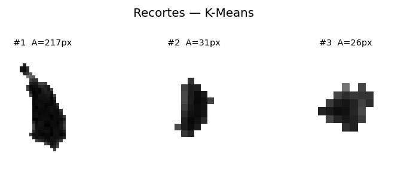
</p>

**Qué es:** galería de recortes de los objetos detectados por K-Means.  
**Qué justifica:** misma técnica de extracción, distinto método de segmentación. Permite comparar qué regiones se aíslan con cada enfoque.

---

## Features detectadas

### Region Growing

| ID  | Área | Perímetro | Centroide (x, y) | BBox (x, y, w, h)  | Ejes M/m      | Orient.° | Excent. | Compact. | I. media |
| --- | ---- | --------- | ---------------- | ------------------ | ------------- | -------- | ------- | -------- | -------- |
| 1   | 258  | 58.53     | (76.7, 158.8)    | (67, 150, 20, 18)  | 19.65 / 15.28 | 119.16   | 0.629   | 0.946    | 19.7     |
| 2   | 220  | 62.43     | (77.5, 178.9)    | (67, 169, 21, 20)  | 22.76 / 12.39 | 139.87   | 0.839   | 0.709    | 16.6     |
| 3   | 197  | 55.46     | (107.1, 185.6)   | (101, 175, 13, 22) | 21.87 / 10.38 | 164.73   | 0.880   | 0.805    | 21.8     |
| 4   | 18   | 13.31     | (51.0, 195.5)    | (49, 193, 5, 6)    | 4.54 / 3.95   | 0.00     | 0.494   | 1.276    | 30.0     |

### K-Means

| ID  | Área | Perímetro | Centroide (x, y) | BBox (x, y, w, h)  | Ejes M/m      | Orient.° | Excent. | Compact. | I. media |
| --- | ---- | --------- | ---------------- | ------------------ | ------------- | -------- | ------- | -------- | -------- |
| 1   | 326  | 104.47    | (107.2, 186.8)   | (98, 168, 18, 39)  | 35.70 / 11.93 | 164.32   | 0.943   | 0.375    | 49.3     |
| 2   | 52   | 26.38     | (50.2, 196.2)    | (47, 191, 8, 11)   | 9.83 / 5.88   | 10.51    | 0.802   | 0.939    | 67.0     |

---

## Estructura del proyecto

| Ruta                         | Contenido                                                                                        |
| ---------------------------- | ------------------------------------------------------------------------------------------------ |
| `README.md`                  | Este archivo: resumen, figuras y estructura                                                      |
| `segment_pet.py`             | Pipeline único: preprocesamiento, bordes, segmentación, morfología, features, máscaras, recortes |
| `requirements.txt`           | Dependencias (numpy, opencv-python, matplotlib)                                                  |
| `imagenes/`                  | Carpeta de entrada; por defecto `pet_cuerpo_completo.png`                                        |
| `resultados/`                | PNG, CSV, recortes y pasos morfológicos generados al ejecutar                                    |
| `resultados/<m>/morfologia/` | Imágenes intermedias de erosión, dilatación, cierre y filtrado                                   |
| `docs/Readme.md`             | Instalación, entorno virtual y salidas                                                           |
| `docs/doc.md`                | Informe / respuestas a la consigna                                                               |
| `.gitignore`                 | Excluye venv/, cachés de Python e ignorados de IDE                                               |

Parámetros útiles en código: `HOT_PERCENTILE`, `REGION_GROW_TOLERANCE`, `KMEANS_K`, `MIN_LESION_AREA`, `ERODE_KERNEL`, `ERODE_ITERATIONS`, `DILATE_KERNEL`, `DILATE_ITERATIONS`, `MORPH_KERNEL`, `CANNY_LOW`/`CANNY_HIGH`, `CROP_PAD`, `MAX_OBJECT_AREA` en `segment_pet.py`.

---

## Clonar o actualizar desde GitHub

```bash
git clone git@github.com:mateoHernandez123/Trabajo-Practico-PET-Morfologia.git
cd Trabajo-Practico-PET-Morfologia
```
