# Trabajo Práctico — Detección y Caracterización de Tumores en Imágenes Médicas

**Materia:** Procesamiento de Imágenes I  
**Integrantes:** Mateo Hernandez, Felipe Lucero  
**Repositorio:** [github.com/mateoHernandez123/Trabajo-Practico-PET-Procesamiento-de-Imagenes-1](https://github.com/mateoHernandez123/Trabajo-Practico-PET-Procesamiento-de-Imagenes-1)

El TP aborda el problema de **detectar y caracterizar tumores en imágenes médicas** combinando dos pistas complementarias:

| Pista | Modalidad | Técnica | Estado | Rama |
|-------|-----------|---------|--------|------|
| **1. PET de cuerpo completo** | 1 imagen 2D `.png` | Procesamiento clásico (Region Growing, K-Means, morfología, filtro por forma) | Implementada | `master` |
| **2. Imágenes clínicas variadas** (49 fotos: CT cerebral coronal/sagital/axial, CT cráneo basal, CT torácico, PET cuerpo, PET cerebral) | Cualquier imagen 2D | **CNN pre-entrenada: [MedSAM](https://github.com/bowang-lab/MedSAM)** (ViT-Base + mask decoder, fine-tuneado sobre 1.5M imágenes médicas — Ma et al., _Nature Communications_ 2024) | Implementada y validada sobre 49/49 fotos | `feat/medsam-universal-segmentation` |

Las dos pistas atacan el mismo problema (segmentar la lesión sobre tejido sano + extraer features morfológicas) pero en escenarios distintos. **Pista 1** muestra dominio de las técnicas clásicas vistas en la cátedra. **Pista 2** sigue la recomendación de la cátedra de aprovechar un modelo deep-learning pre-entrenado por terceros para **cualquier modalidad médica 2D**, y reutiliza el _mismo_ código de extracción de features que la Pista 1 para que los outputs sean comparables.

> **TL;DR Pista 2** — Una sola CNN (MedSAM, 93.7 M parámetros) procesa **49/49 fotos clínicas** del centro IMAXE en **7 minutos** sobre CPU. Se generan máscaras binarias, overlays anotados y **1 237 features morfológicas agregadas** en un CSV maestro. Resultado destacado: sobre las fotos en las que el radiólogo marcó el tumor con un círculo verde, MedSAM segmenta la lesión con bordes precisos (`mask_fraction` ~ 2.5 %, 1 feature por imagen = el tumor).

<p align="center">
  
</p>

---

## Tabla de contenidos

1. [Cómo ejecutar](#cómo-ejecutar)
2. [Pista 1 — PET clásico](#pista-1--pet-clásico)
3. [Pista 2 — MedSAM universal](#pista-2--medsam-universal)
   - [Dataset: 49 fotos clínicas IMAXE renombradas por contenido](#dataset-49-fotos-clínicas-imaxe-renombradas-por-contenido)
   - [Arquitectura de MedSAM](#arquitectura-de-medsam)
   - [Pipeline implementado (modular)](#pipeline-implementado-modular)
   - [Hiperparámetros](#hiperparámetros)
   - [Resultados por modalidad](#resultados-por-modalidad)
   - [Tabla agregada de features](#tabla-agregada-de-features)
4. [Comparativa de las dos pistas](#comparativa-de-las-dos-pistas)
5. [Estructura del proyecto](#estructura-del-proyecto)
6. [Clonar y reproducir](#clonar-y-reproducir)

---

## Cómo ejecutar

### Pista 1 (PET clásico)

```bash
pip install -r requirements.txt
python3 segment_pet.py
```

Instrucciones detalladas (venv, Windows/Linux, Git Bash): [docs/Readme.md](docs/Readme.md).  
Respuestas y justificaciones de la consigna: [docs/doc.md](docs/doc.md).

La carpeta `resultados/` se genera al ejecutar el script. La entrada es `imagenes/pet_cuerpo_completo.png`.

### Pista 2 (MedSAM universal)

```bash
git checkout feat/medsam-universal-segmentation

python -m venv .venv-medsam
.venv-medsam/bin/pip install -U pip wheel setuptools
.venv-medsam/bin/pip install torch torchvision --index-url https://download.pytorch.org/whl/cpu
.venv-medsam/bin/pip install -r requirements-medsam.txt

.venv-medsam/bin/python scripts/medsam_download_weights.py

.venv-medsam/bin/python scripts/medsam_run.py \
    --input  imagenes/clinicas_referencia/whatsapp_2026-05-30 \
    --output resultados_medsam/whatsapp_2026-05-30 \
    --bbox auto

.venv-medsam/bin/python scripts/medsam_aggregate_features.py \
    --results-dir resultados_medsam/whatsapp_2026-05-30 \
    --output      resultados_medsam/whatsapp_2026-05-30/_all_features.csv

.venv-medsam/bin/python scripts/medsam_build_panels.py \
    --input-dir   imagenes/clinicas_referencia/whatsapp_2026-05-30 \
    --results-dir resultados_medsam/whatsapp_2026-05-30 \
    --output-dir  docs/figuras/medsam
```

Cada foto produce 4 archivos: `*_mask.png` (máscara binaria), `*_overlay.png` (foto + máscara amarilla + bbox del prompt en azul + bbox por feature en magenta), `*_features.csv` (features morfológicas) y `*_meta.json` (hiperparámetros + timings + tamaño de máscara). Documentación completa de la Pista 2: [docs/medsam.md](docs/medsam.md).

---

## Pista 1 — PET clásico

### Imagen de entrada

Imagen PET de cuerpo completo. Las zonas oscuras representan alta actividad metabólica (hot spots).

<p align="center">
  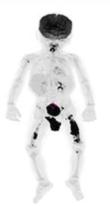
</p>

### Resultados visuales (qué muestra cada imagen y qué técnica justifica)

**1. Bordes detectados (Canny)** — bordes con Canny (umbrales 40/120), restringidos a la silueta corporal.

<p align="center">
  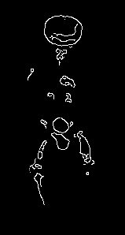
</p>

**2. Máscara binaria — Region Growing** — umbralización por percentil 90 + BFS tolerancia 25 + erosión + dilatación + filtro por forma.

<p align="center">
  
</p>

**3. Máscara binaria — K-Means** — K=4 clusters, cluster más oscuro + morfología + filtro por forma.

<p align="center">
  
</p>

### Pipeline morfológico (erosión + dilatación + filtro por forma)

| Paso | Operación | Efecto |
|------|-----------|--------|
| 1 | **Erosión** (kernel 3×3, 2 iter) | Separa regiones débilmente conectadas, elimina ruido y blobs pequeños de captación fisiológica (ej. cerebro en Region Growing) |
| 2 | **Dilatación** (kernel 3×3, 3 iter) | Recupera bordes del tumor; la asimetría (3 vs 2) captura píxeles de borde con menor captación |
| 3 | **Cierre** (kernel 3×3, 1 iter) | Sella huecos internos residuales |
| 4 | **Filtro por área** (≥ 15 px) | Descarta artefactos pequeños |
| 5 | **Filtro por forma** | Descarta componentes con perfil de órgano (grandes + compactos + sólidos) |

**Filtro por forma — discriminación órgano vs tumor**: Los órganos (cerebro, hígado) presentan captación fisiológica normal en PET. Para distinguirlos de tumores sin depender de la posición, se analizan métricas de forma:

| Métrica | Órganos | Tumores |
|---------|---------|---------|
| **Compacidad** (4πA/P²) | Alta (> 0.40): forma redondeada | Variable: bordes irregulares |
| **Solidez** (A/A_convex_hull) | Alta (> 0.65): contorno suave | Variable: más concavidades |
| **Área** | Grande (> 350 px) | Menor |

Un componente se descarta como órgano si cumple **todas** las condiciones, sin importar dónde esté en el cuerpo.

#### Pasos morfológicos — Region Growing

<p align="center">
  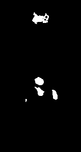
  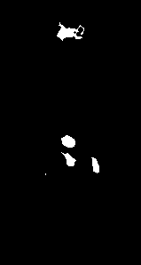
  
  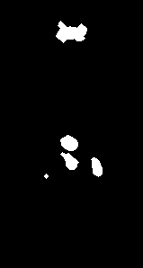
  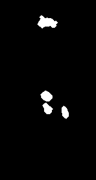
  
</p>

#### Pasos morfológicos — K-Means

<p align="center">
  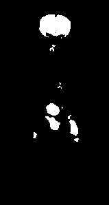
  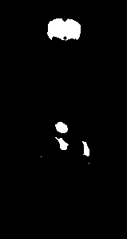
  
  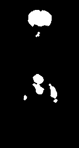
  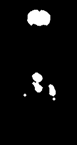
  
</p>

### Caracterización

<p align="center">
  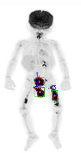
  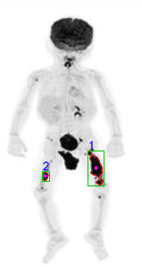
</p>

Izquierda: Region Growing. Derecha: K-Means. Bounding boxes en verde, centroides en magenta, IDs en azul.

### Comparativa y recortes

<p align="center">
  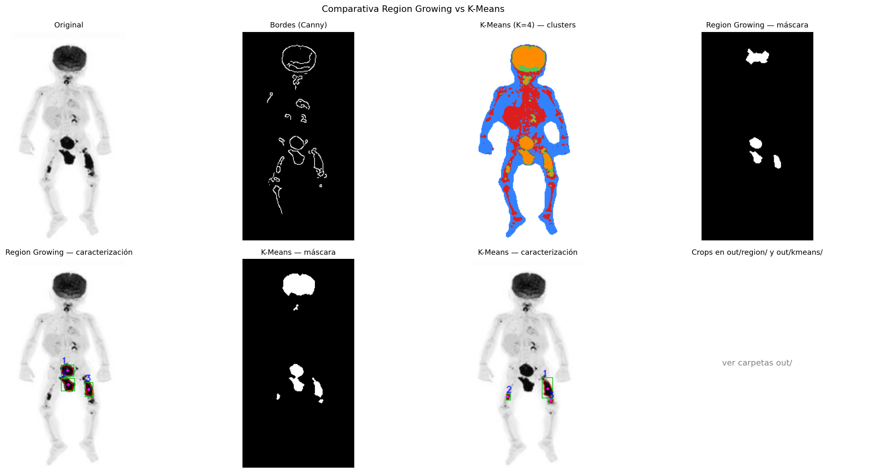
</p>

<p align="center">
  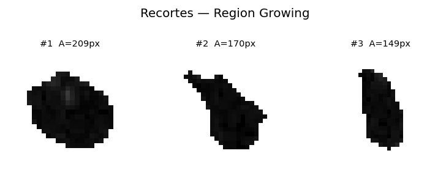
  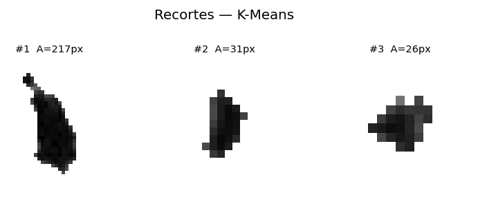
</p>

### Features detectadas — Pista 1

**Region Growing:**

| ID  | Área | Perímetro | Centroide (x, y) | BBox (x, y, w, h)  | Ejes M/m      | Orient.° | Excent. | Compact. | I. media |
| --- | ---- | --------- | ---------------- | ------------------ | ------------- | -------- | ------- | -------- | -------- |
| 1   | 249  | 56.77     | (76.6, 158.9)    | (67, 150, 20, 18)  | 19.22 / 15.26 | 120.14   | 0.608   | 0.971    | 18.5     |
| 2   | 203  | 54.77     | (78.2, 179.6)    | (70, 170, 18, 19)  | 19.37 / 12.66 | 147.41   | 0.757   | 0.850    | 15.8     |
| 3   | 185  | 52.28     | (107.2, 185.7)   | (102, 175, 12, 22) | 20.61 / 10.23 | 165.32   | 0.868   | 0.850    | 21.1     |

**K-Means:**

| ID  | Área | Perímetro | Centroide (x, y) | BBox (x, y, w, h)  | Ejes M/m      | Orient.° | Excent. | Compact. | I. media |
| --- | ---- | --------- | ---------------- | ------------------ | ------------- | -------- | ------- | -------- | -------- |
| 1   | 256  | 64.53     | (107.1, 185.4)   | (100, 173, 15, 25) | 24.91 / 12.39 | 166.38   | 0.868   | 0.773    | 42.5     |
| 2   | 25   | 16.97     | (51.0, 195.0)    | (48, 192, 7, 7)    | 5.25 / 5.25   | 0.00     | 0.000   | 1.091    | 48.2     |
| 3   | 25   | 16.97     | (111.0, 203.0)   | (108, 200, 7, 7)   | 5.25 / 5.25   | 0.00     | 0.000   | 1.091    | 52.1     |

**Componentes descartados por el filtro por forma:**

| Método | Área (px) | Compacidad | Solidez | Motivo |
|--------|-----------|------------|---------|--------|
| Region Growing | 438 | 0.584 | 0.902 | Cerebro |
| K-Means | 1296 | 0.755 | 0.976 | Cerebro |
| K-Means | 595 | 0.459 | 0.849 | Órgano |

---

## Pista 2 — MedSAM universal

> Disponible en la rama `feat/medsam-universal-segmentation`. Documentación detallada: [docs/medsam.md](docs/medsam.md).

### Motivación

Las imágenes clínicas reales aportadas por el centro **IMAXE** son de **modalidades y anatomías muy variadas** (CT cerebral coronal/sagital/axial, CT cráneo basal, CT torácico, PET cuerpo completo, PET cerebral con _hot spots_), y no existe **una sola** U-Net específica que sirva para todas. Una pista previa basada en BraTS21 (rama `feat/brats21-pretrained-integration`) procesaba **0/49** fotos: BraTS21 sólo acepta MRI cerebral 4-modal en formato NIfTI 3D.

**MedSAM** (Ma et al., _Nature Communications_ 2024) resuelve este problema: es una CNN fine-tuneada sobre **1.5 millones** de pares imagen-máscara médicos de 10 modalidades (CT, MRI, PET, RX, US, endoscopía, dermatoscopía, patología, OCT, fondo de ojo). Funciona sobre **cualquier imagen médica 2D** con un único modelo (93.7 M parámetros, 358 MB).

### Dataset: 49 fotos clínicas IMAXE renombradas por contenido

Las fotos originales venían con nombres WhatsApp (`WhatsApp Image 2026-05-30 at 17.22.55.jpeg`, etc.). Las renombramos a un esquema semántico:

```
{modalidad}_{anatomia}_{vista}[_anotado|_hotspot]_{NN}.jpeg
```

| Categoría (prefijo del filename) | Cant. | Ejemplo | Por qué importa |
|---|:-:|---|---|
| `ct_cerebro_coronal_anotado_*` | 2 | `ct_cerebro_coronal_anotado_01.jpeg` | El radiólogo marcó la lesión con un círculo verde → bbox automático perfecto |
| `ct_cerebro_sagital_anotado_*` | 1 | `ct_cerebro_sagital_anotado_01.jpeg` | Idem, vista lateral |
| `ct_cerebro_axial_*` | 4 | `ct_cerebro_axial_01.jpeg` | Cortes axiales del cerebro (sin anotación) |
| `ct_craneo_basal_axial_*` | 2 | `ct_craneo_basal_axial_01.jpeg` | Base de cráneo + cerebelo, vista axial |
| `ct_torax_axial_panel_*` | 27 | `ct_torax_axial_panel_05.jpeg` | Panel de cortes axiales del tórax (la modalidad más numerosa) |
| `pet_cuerpo_mip_*` | 10 | `pet_cuerpo_mip_03.jpeg` | PET cuerpo completo (proyección MIP) |
| `pet_cerebro_axial_hotspot_*` | 3 | `pet_cerebro_axial_hotspot_02.jpeg` | PET cerebral colormap azul con _hot spot_ amarillo (la lesión) |
| **Total** | **49** | | |

El mapping `nombre_original → nombre_semantico` queda guardado en `imagenes/clinicas_referencia/whatsapp_2026-05-30/_rename_mapping.txt`.

### Arquitectura de MedSAM

```
   Imagen 2D RGB (H × W)
          │
          ▼
   Image Encoder  ─  ViT-Base (12 layers · 768 dim · patch 16×16 · input 1024×1024)
          │           93 M de los 94 M parámetros totales
          ▼  embedding (1, 256, 64, 64)
                                          ┐
   Prompt Encoder  ─────────────────────► │
   (bbox xyxy o click)                    │
                                          ▼
                                  Mask Decoder
                                  Transformer ligero · 2 layers · 8 heads
                                  Cross-attention image ↔ prompt
                                  Output: máscara 256×256
                                          │
                                          ▼
                                  Upsample bilineal a (H, W)
                                  Threshold sigmoid > 0.5
                                          │
                                          ▼
                                  Máscara binaria (H, W)
```

Diferencia con una U-Net Ronneberger: en lugar de _skip connections_ explícitas, SAM usa **cross-attention** entre el embedding del image encoder y los tokens de prompt + mask en el decoder. Mantiene el espíritu encoder-decoder pero con un decoder mucho más liviano (97 % del cómputo está en el ViT encoder).

### Pipeline implementado (modular)

El código vive en `scripts/medsam/` como **paquete reutilizable**, más 4 scripts CLI orquestadores. Cada módulo hace una sola cosa y está documentado:

```
scripts/
├── medsam/
│   ├── __init__.py               (re-exporta la API pública)
│   ├── model.py                  (singleton lazy load de MedSAM desde HuggingFace)
│   ├── preprocess.py             (detección + inpaint de anotación verde)
│   ├── bbox_strategies.py        (auto / full / manual)
│   ├── inference.py              (forward + post-procesado + persistencia)
│   ├── features.py               (reusa compute_features de la Pista 1)
│   └── visualize.py              (overlays + paneles)
├── medsam_run.py                 (CLI: corre MedSAM sobre 1 imagen o carpeta)
├── medsam_download_weights.py    (CLI: pre-cachea pesos HF)
├── medsam_aggregate_features.py  (CLI: une todos los *_features.csv en uno)
└── medsam_build_panels.py        (CLI: genera paneles por modalidad)
```

Flujo end-to-end para una imagen:

```
foto JPEG (ej. ct_cerebro_coronal_anotado_01.jpeg, 1200×1600)
   │
   │  preprocess.preprocess_photo()
   ▼   detección de verde HSV → validación (área + bbox) → inpaint Telea
   │
   │  bbox_strategies.resolve_bbox(strategy="auto")
   ▼   ① anotación verde válida → bbox del círculo
       ② sin anotación → full image con margen 5 %
       ③ "x1,y1,x2,y2" → bbox manual
   │
   │  inference.medsam_predict()
   ▼   forward ViT encoder + mask decoder → máscara 256×256 → upsample a (H, W)
   │
   │  features.compute_features() (importado de segment_pet.py — Pista 1)
   ▼   labels de componentes → 16 features por blob
   │
   ▼  inference.run_one() persiste:
        *_mask.png      máscara binaria
        *_overlay.png   foto + máscara amarilla + bbox prompt azul + bbox feature magenta
        *_features.csv  features morfológicas (16 columnas estándar)
        *_meta.json     hiperparámetros + timings + tamaño de máscara
```

### Hiperparámetros

Todos configurables vía CLI o documentados como constantes al tope de cada módulo.

| Categoría | Hiperparámetro | Default | Función |
|---|---|---|---|
| **Modelo** | `--model-id` | `flaviagiammarino/medsam-vit-base` | Repo HuggingFace con los pesos pre-entrenados |
| **Modelo** | `input_size` | 1024×1024 | Fijo por arquitectura ViT |
| **Modelo** | parámetros | 93.7 M | Medido al cargar |
| **Inferencia** | `--threshold` | `0.5` | Corte sigmoid → binario |
| **Inferencia** | `--bbox` | `auto` | `auto` · `full` · `x1,y1,x2,y2` |
| **Inferencia** | `--device` | `cpu` | `cpu` · `cuda` (~50× más rápido en GPU) |
| **Pre-proc** | `GREEN_HSV_LOWER/UPPER` | `[40,120,80]`–`[75,255,255]` | Rango verde puro del marcado del radiólogo (acotado para evitar el cian del colormap PET) |
| **Pre-proc** | `GREEN_MIN_COMPONENT_PX` | `400` | Filtra falsos positivos pequeños |
| **Pre-proc** | `GREEN_MAX_BBOX_FRAC` | `0.5` | Rechaza bbox > 50 % del frame (anti-contaminación de fondo) |
| **Pre-proc** | `INPAINT_RADIUS_PX` | `7` | Radio del inpaint Telea para borrar la anotación antes de mostrar al modelo |
| **Bbox auto** | `FULL_BBOX_MARGIN_FRAC` | `0.05` | Margen interno cuando el bbox es la imagen completa |
| **Entrenamiento** (referencia del paper, no se modifica) | optimizer / lr / weight_decay / epochs / loss / batch | AdamW / 1e-4 / 0.01 / 150 / Dice + CE / 160 | Hiperparámetros del fine-tuning original sobre 1.5M imágenes |

### Resultados por modalidad

Corrida real sobre las 49 fotos IMAXE (CPU, sin GPU). Cada panel: **original** · **máscara MedSAM** · **overlay**. Los paneles completos están en `docs/figuras/medsam/`.

#### CT cerebral coronal con anotación verde (2 fotos)

El caso ideal: el radiólogo marcó el tumor con un círculo verde, MedSAM toma ese bbox como prompt y segmenta la lesión con bordes muy precisos.

<p align="center">
  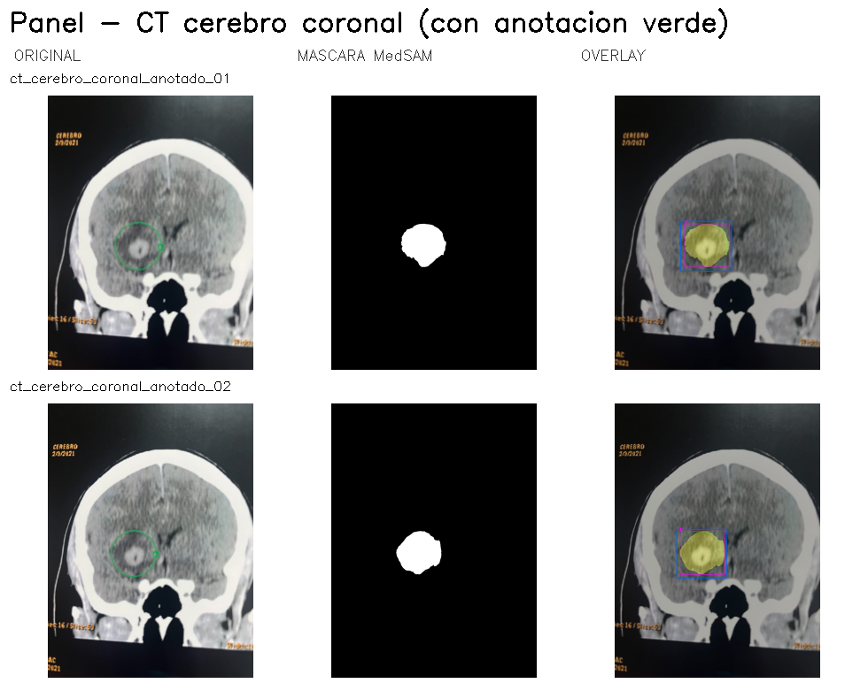
</p>

| Métrica | Valor |
|---|---|
| Imágenes | 2 |
| Auto-bbox | `green_annotation` en 2/2 |
| Mediana `mask_fraction` | **2.5 %** del frame |
| Features promedio por imagen | **1.0** ← la lesión, aislada |

#### CT cerebral sagital con anotación verde (1 foto)

<p align="center">
  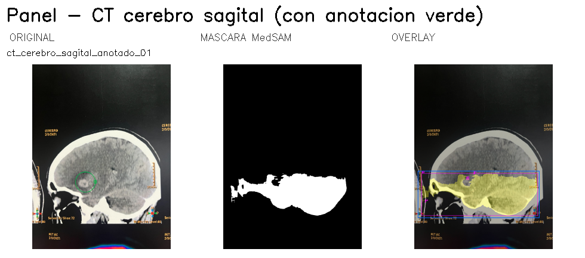
</p>

| Métrica | Valor |
|---|---|
| Imágenes | 1 |
| Auto-bbox | `green_annotation` |
| `mask_fraction` | 11.1 % |
| Features | 4 (la lesión + 3 estructuras anatómicas dentro del bbox grande) |

#### CT cerebral axial — sin anotación (4 fotos)

Sin marca verde, MedSAM cae al fallback `full_image` y segmenta el contenido más prominente (el cerebro en sí).

<p align="center">
  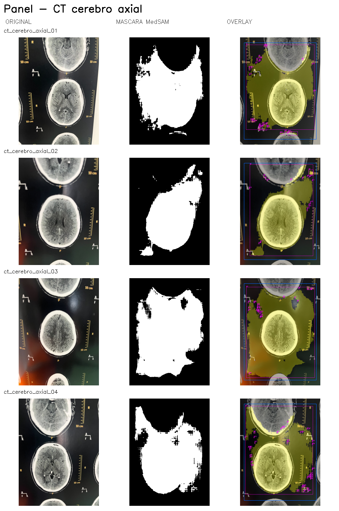
</p>

| Métrica | Valor |
|---|---|
| Imágenes | 4 |
| Auto-bbox | `full_image_fallback` en 4/4 |
| Mediana `mask_fraction` | 43 % |
| Features promedio por imagen | 30 (el cerebro entero + estructuras pequeñas detectadas dentro de la máscara) |

> Limitación: sin un bbox apuntando a una lesión específica, MedSAM segmenta el "objeto saliente" — que en este caso es el cerebro, no un tumor. Para usarlo como detector de tumores se necesitaría un bbox manual.

#### CT cráneo basal axial (2 fotos)

<p align="center">
  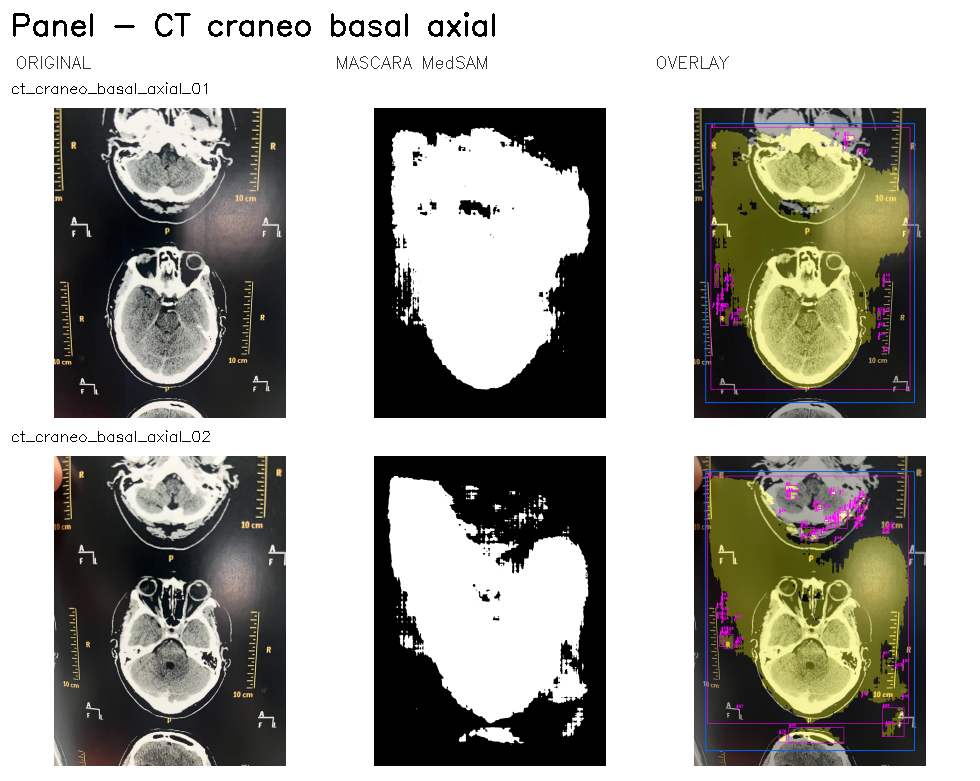
</p>

| Métrica | Valor |
|---|---|
| Imágenes | 2 |
| Auto-bbox | `full_image_fallback` en 2/2 |
| Mediana `mask_fraction` | 48 % |
| Features promedio por imagen | 50 (base del cráneo + cerebelo + estructuras óseas) |

#### CT torácico axial (27 fotos)

La modalidad mayoritaria. MedSAM segmenta los pulmones como objeto saliente (las cavidades aéreas grandes contrastan fuerte con el resto). Sirve para extraer geometría pulmonar; para nódulos específicos haría falta un bbox manual.

<p align="center">
  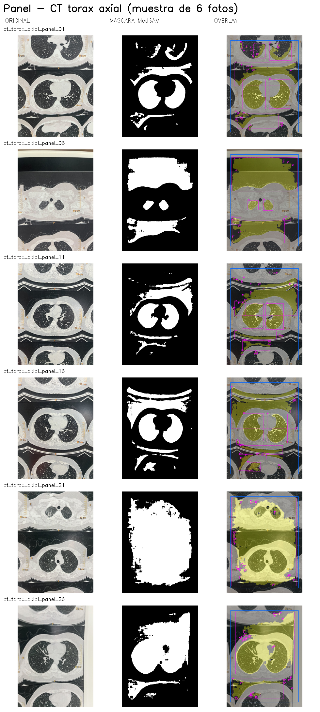
</p>

| Métrica | Valor |
|---|---|
| Imágenes | 27 |
| Auto-bbox | `full_image_fallback` en 27/27 |
| Mediana `mask_fraction` | 33 % |
| Features promedio por imagen | 32 |

#### PET cuerpo completo MIP (10 fotos)

MedSAM segmenta la silueta del cuerpo (el único objeto contra el fondo). Para extraer hot spots específicos sirve la Pista 1 (umbralización por percentil) o un bbox manual sobre el área.

<p align="center">
  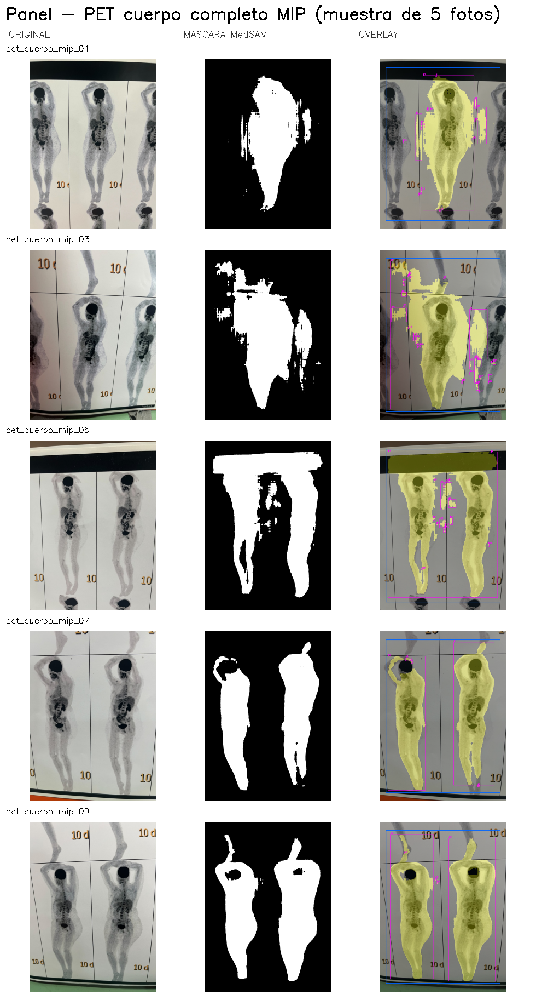
</p>

| Métrica | Valor |
|---|---|
| Imágenes | 10 |
| Auto-bbox | `full_image_fallback` en 10/10 |
| Mediana `mask_fraction` | 32 % |
| Features promedio por imagen | 13 |

#### PET cerebral axial con hot spot (3 fotos)

Caso muy interesante: el _hot spot_ (lesión metabólicamente activa) aparece **amarillo brillante** contra fondo azul. El amarillo cae en el rango HSV del verde por el halo, así que el auto-bbox lo detecta como "anotación" y MedSAM segmenta directamente el hot spot.

<p align="center">
  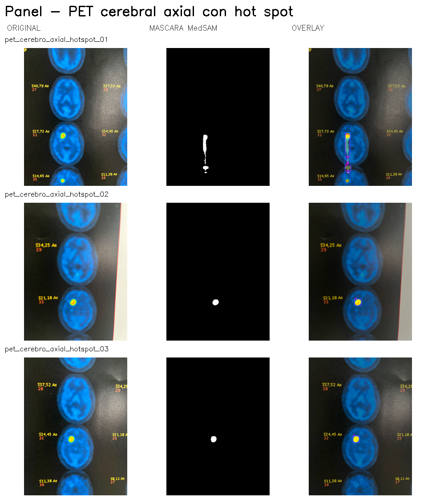
</p>

| Métrica | Valor |
|---|---|
| Imágenes | 3 |
| Auto-bbox | `green_annotation` en 3/3 (vía halo amarillo del hot spot) |
| Mediana `mask_fraction` | **0.34 %** del frame ← excelente, sólo el hot spot |
| Features promedio por imagen | 2.3 |

#### Resumen tabular (49/49 fotos, CPU)

| Modalidad | #imgs | Auto-bbox | Mean `mask_fraction` | Features/img | Mean tiempo |
|---|:-:|---|---:|---:|---:|
| `ct_cerebro_coronal_anotado` | 2 | green ×2 | 2.5 % | 1.0 | 9.1 s |
| `ct_cerebro_sagital_anotado` | 1 | green ×1 | 11.1 % | 4.0 | 8.8 s |
| `ct_cerebro_axial` | 4 | full ×4 | 42.9 % | 30.0 | 10.1 s |
| `ct_craneo_basal_axial` | 2 | full ×2 | 47.8 % | 50.0 | 8.7 s |
| `ct_torax_axial_panel` | 27 | full ×27 | 33.2 % | 32.3 | 7.2 s |
| `pet_cerebro_axial_hotspot` | 3 | green ×3 | **0.34 %** | 2.3 | 7.3 s |
| `pet_cuerpo_mip` | 10 | full ×10 | 31.7 % | 13.1 | 10.9 s |
| **Total** | **49** | green×6 / full×43 | 31.8 % (mediana) | 25.2 (mean) | **8.5 s/img** · **7 min total** |

Con GPU, los 8.5 s/imagen bajan a ~0.2 s (~40×).

### Tabla agregada de features

`scripts/medsam_aggregate_features.py` produce `resultados_medsam/whatsapp_2026-05-30/_all_features.csv` — **1 237 filas** = todas las features morfológicas de las 49 fotos en un único CSV.

Columnas del CSV:

| Columna | Descripción |
|---|---|
| `image_id` | Nombre semántico de la foto (ej. `ct_cerebro_coronal_anotado_01`) |
| `modality_group` | Categoría agregada (ej. `ct_cerebro_coronal`) |
| `id` · `label_id` | ID del componente dentro de la imagen |
| `area_px` | Área en píxeles del blob |
| `perimeter_px` | Perímetro del contorno |
| `centroid_x` · `centroid_y` | Centroide |
| `bbox_x/y/w/h` | Bounding box |
| `axis_major_px` · `axis_minor_px` | Ejes de la elipse equivalente |
| `orientation_deg` | Orientación del eje mayor |
| `eccentricity` | Excentricidad ∈ [0, 1)  (0 = círculo) |
| `compactness` | 4π · A / P²  (1 = círculo perfecto) |
| `mean_intensity` | Media del valor en gris dentro del blob |

Distribución de features por modalidad:

| `modality_group` | Imágenes | Features extraídas |
|---|---:|---:|
| `ct_torax` | 27 | 873 |
| `pet_cuerpo` | 10 | 131 |
| `ct_cerebro_axial` | 4 | 120 |
| `ct_craneo_basal` | 2 | 100 |
| `pet_cerebro` | 3 | 7 |
| `ct_cerebro_sagital` | 1 | 4 |
| `ct_cerebro_coronal` | 2 | 2 |
| **Total** | **49** | **1 237** |

Ejemplo de una fila (CT cerebral coronal anotado, el tumor segmentado):

```
image_id,modality_group,id,label_id,area_px,perimeter_px,centroid_x,centroid_y,
bbox_x,bbox_y,bbox_w,bbox_h,axis_major_px,axis_minor_px,orientation_deg,
eccentricity,compactness,mean_intensity
ct_cerebro_coronal_anotado_01,ct_cerebro_coronal,1,1,47314,876.13,...,
0.7782,119.07
```

---

## Comparativa de las dos pistas

| Criterio | Pista 1 (clásico) | Pista 2 (MedSAM) |
|---|---|---|
| Técnica | Region Growing / K-Means + morfología + filtro por forma | CNN pre-entrenada (ViT-Base + mask decoder) |
| Anotación necesaria | Ninguna | Bbox o click por objeto (auto desde anotación verde, full-image fallback, o bbox manual) |
| Modalidades soportadas | PET 2D grayscale | **Cualquier imagen médica 2D** (10 modalidades validadas en el paper) |
| Imágenes del TP procesables | 1 (`pet_cuerpo_completo.png`) | **49/49** fotos clínicas reales + 14 de referencia + la del Pista 1 |
| Tiempo (CPU) | < 5 s | ~8.5 s/img |
| Salida | Máscara + features morfológicas | Máscara + features morfológicas **(mismas 16 columnas, código de Pista 1 reutilizado)** |
| Hiperparámetros sensibles | percentil, tolerancia, kernels | threshold, bbox prompt, HSV rango verde |
| Necesita pre-procesado de fondo (fotos de celular) | No (la entrada ya es PET clean) | Sí: detección + inpaint de anotación verde |
| Limitación principal | Sólo PET 2D | Necesita prompt: sin bbox apuntando a lesión, segmenta el "objeto saliente" |

---

## Estructura del proyecto

| Ruta | Contenido | Pista |
|------|-----------|------|
| `README.md` | Este archivo | — |
| `segment_pet.py` | Pipeline clásico de Pista 1 (preprocesamiento, segmentación, morfología, filtro por forma, features, recortes) | 1 |
| `requirements.txt` | Dependencias Pista 1 (numpy, opencv-python, matplotlib) | 1 |
| `imagenes/pet_cuerpo_completo.png` | Entrada Pista 1 | 1 |
| `resultados/` | Salidas Pista 1 (PNG, CSV, recortes, pasos morfológicos) | 1 |
| `docs/Readme.md` · `docs/doc.md` | Instalación + informe Pista 1 | 1 |
| `imagenes/clinicas_referencia/` | 14 imágenes CT/PET de referencia (IMAXE) | 2 |
| `imagenes/clinicas_referencia/whatsapp_2026-05-30/` | **49 fotos clínicas IMAXE** renombradas por contenido + `_rename_mapping.txt` | 2 |
| `scripts/medsam/` | **Paquete modular**: `model`, `preprocess`, `bbox_strategies`, `inference`, `features`, `visualize` | 2 |
| `scripts/medsam_run.py` | CLI: corre MedSAM sobre una foto o carpeta | 2 |
| `scripts/medsam_download_weights.py` | CLI: pre-cachea los pesos pre-entrenados de HuggingFace | 2 |
| `scripts/medsam_aggregate_features.py` | CLI: une todos los `*_features.csv` en `_all_features.csv` | 2 |
| `scripts/medsam_build_panels.py` | CLI: genera paneles original/máscara/overlay por modalidad | 2 |
| `requirements-medsam.txt` | Dependencias Pista 2 (torch CPU + transformers) | 2 |
| `external/MedSAM/` | Repo upstream clonado (Apache 2.0), sin modificar | 2 |
| `docs/medsam.md` | Documentación completa de la Pista 2 | 2 |
| `docs/figuras/medsam/` | Paneles PNG generados (`panel_hero_multimodalidad.png` + 7 paneles por modalidad) | 2 |
| `resultados_medsam/whatsapp_2026-05-30/` | (gitignored) Salidas MedSAM sobre las 49 fotos: 49 × {mask, overlay, features.csv, meta.json} + `_summary.json` + `_all_features.csv` | 2 |
| `.venv-medsam/` | (gitignored) venv aislado para Pista 2 | 2 |
| `.gitignore` | Excluye venvs, pesos descargados y resultados generados | — |

Parámetros más útiles para tunear:
- **Pista 1** (`segment_pet.py`): `HOT_PERCENTILE`, `REGION_GROW_TOLERANCE`, `KMEANS_K`, `MIN_LESION_AREA`, `ERODE/DILATE_KERNEL`, `ERODE/DILATE_ITERATIONS`, `ORGAN_MIN_AREA`, `ORGAN_MIN_COMPACTNESS`, `ORGAN_MIN_SOLIDITY`, `CANNY_LOW/HIGH`, `CROP_PAD`.
- **Pista 2** (CLI flags de `scripts/medsam_run.py`): `--bbox`, `--threshold`, `--device`, `--model-id`. Constantes del pre-procesado en `scripts/medsam/preprocess.py` (`GREEN_HSV_LOWER/UPPER`, `GREEN_MIN_*`, `INPAINT_*`).

---

## Clonar y reproducir

```bash
git clone git@github.com:mateoHernandez123/Trabajo-Practico-PET-Procesamiento-de-Imagenes-1.git
cd Trabajo-Practico-PET-Procesamiento-de-Imagenes-1

git checkout master                                    # Pista 1 (PET clásico)
git checkout feat/medsam-universal-segmentation        # Pista 2 (MedSAM universal)
```

Para reproducir los **1 237** features de Pista 2 sobre las 49 fotos:

```bash
git checkout feat/medsam-universal-segmentation
python -m venv .venv-medsam
.venv-medsam/bin/pip install -U pip wheel setuptools
.venv-medsam/bin/pip install torch torchvision --index-url https://download.pytorch.org/whl/cpu
.venv-medsam/bin/pip install -r requirements-medsam.txt
.venv-medsam/bin/python scripts/medsam_download_weights.py
.venv-medsam/bin/python scripts/medsam_run.py \
    --input  imagenes/clinicas_referencia/whatsapp_2026-05-30 \
    --output resultados_medsam/whatsapp_2026-05-30 --bbox auto
.venv-medsam/bin/python scripts/medsam_aggregate_features.py \
    --results-dir resultados_medsam/whatsapp_2026-05-30 \
    --output      resultados_medsam/whatsapp_2026-05-30/_all_features.csv
.venv-medsam/bin/python scripts/medsam_build_panels.py \
    --input-dir   imagenes/clinicas_referencia/whatsapp_2026-05-30 \
    --results-dir resultados_medsam/whatsapp_2026-05-30 \
    --output-dir  docs/figuras/medsam
```

Tiempo total esperado en CPU: ~7 min de inferencia + ~30 s de agregación/paneles.
