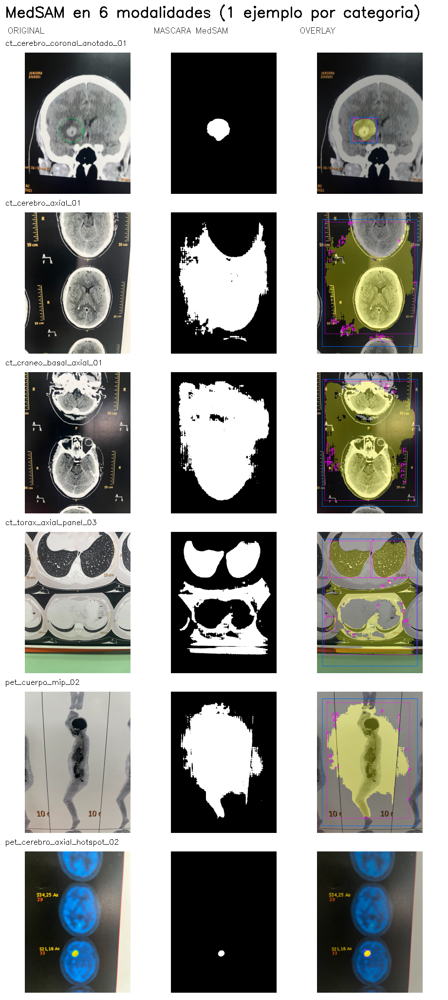

# Pista 2 — Segmentación universal con MedSAM

> **Reemplaza** la pista BraTS21 previa (rama `feat/brats21-pretrained-integration`),
> que estaba limitada a MRI cerebral 4-modal. MedSAM funciona sobre **cualquier
> imagen médica 2D** (CT, MRI, PET, RX, US, etc.) y por eso puede procesar las
> 49 fotos clínicas reales aportadas (CT cerebral, CT torácico, PET cuerpo
> completo, PET cerebral) sin cambiar de modelo.

## 1. Por qué MedSAM (y no BraTS21)

| Criterio | BraTS21 (pista anterior) | MedSAM (pista nueva) |
|---|---|---|
| Tipo de modelo | U-Net 3D (specifica BraTS) | SAM ViT-Base + mask decoder, fine-tuneado sobre 1.5M imágenes médicas (Ma et al., Nature Communications 2024) |
| Modalidades soportadas | MRI cerebral 4-modal (T1, T1ce, T2, FLAIR) | CT, MRI, PET, RX, US, endoscopía, dermatoscopía, patología, OCT, fondo de ojo |
| Anatomías | Cerebro | Cualquiera |
| Formato esperado | NIfTI 3D | Cualquier imagen 2D (JPG/PNG/DICOM frame) |
| Match con material clínico aportado (IMAXE) | **0/14** (todas son CT/PET 2D, no MRI 3D) | **49/49** |
| Tamaño del modelo | ~16M parámetros × 10 folds (~617 MB) | ~94M parámetros × 1 (~358 MB) |
| Tiempo de inferencia (CPU) | 48–500 s por caso | ~10 s por imagen |
| Forma de uso | Inferencia automática (no necesita prompt) | **Prompt-based**: requiere bbox o click por objeto |

## 2. Arquitectura de MedSAM

MedSAM es un **fine-tuning** del [Segment Anything Model (SAM)](https://github.com/facebookresearch/segment-anything) de Meta sobre 1.5M pares imagen-máscara médicos curados de 10 modalidades. Comparte la arquitectura de SAM:

```
   Imagen 2D (RGB, H×W)
          │
          ▼
   Image Encoder (ViT-Base)   ─────────┐
   12 layers, 768 dim                  │
   Patch size 16×16                    │
   Resize a 1024×1024                  │
   Output: embedding (1, 256, 64, 64)  │
                                       ▼
                              Mask Decoder
   Prompt Encoder  ───────►   Transformer ligero
   (bbox xyxy o puntos)        2 layers, 8 heads
                               Output: máscara 256×256
                                       │
                                       ▼
                              Upsample bilineal a (H, W)
                              Threshold sigmoid > 0.5
                                       │
                                       ▼
                              Máscara binaria (H, W)
```

Diferencia con U-Net Ronneberger: en lugar de skip connections explícitas entre encoder y decoder, SAM usa **cross-attention** entre el embedding del image encoder y los tokens de prompt + mask en el decoder. Conserva el espíritu encoder-decoder pero con un decoder mucho más liviano (97% del cómputo está en el ViT encoder).

**Parámetros: ~94 M** (medido en este equipo cargando `flaviagiammarino/medsam-vit-base`).

## 3. Hiperparámetros

Todos los hiperparámetros son **configurables vía CLI** del runner y están documentados como constantes al tope de cada script.

### 3.1 Pre-procesado (`scripts/medsam/preprocess.py`)

| Constante | Default | Función |
|---|---|---|
| `GREEN_HSV_LOWER`, `GREEN_HSV_UPPER` | `[40,120,80]` – `[75,255,255]` | Rango HSV para detectar el círculo verde de marcado del radiólogo |
| `GREEN_MIN_TOTAL_PX` | `800` | Píxeles totales mínimos para validar la detección (filtra ruido) |
| `GREEN_MIN_COMPONENT_PX` | `400` | Tamaño mínimo del componente más grande |
| `GREEN_MAX_BBOX_FRAC` | `0.5` | El bbox NO debe cubrir > 50% del frame (filtra falsos positivos por contaminación de fondo) |
| `INPAINT_RADIUS_PX` | `7` | Radio que mira `cv2.inpaint` para inferir el color de relleno |
| `INPAINT_METHOD` | `cv2.INPAINT_TELEA` | Algoritmo de inpaint (alt: `INPAINT_NS`) |
| `GREEN_DILATE_KERNEL`, `GREEN_DILATE_ITERATIONS` | `5`, `2` | Dilatación de la máscara verde antes de inpaint (cubre antialiasing del borde) |
| `SCAN_CROP_THRESHOLD` | `30` | (opcional, `--crop-scan`) píxeles más oscuros que esto = fondo |
| `SCAN_CROP_MIN_AREA_FRAC` | `0.15` | El bbox del scan recortado debe ocupar ≥ 15% del frame |

### 3.2 Inferencia MedSAM (`scripts/medsam_run.py` + `scripts/medsam/inference.py`)

| Hiperparámetro | Default | Función |
|---|---|---|
| `--model-id` | `flaviagiammarino/medsam-vit-base` | Repo HuggingFace con los pesos pre-entrenados |
| `DEFAULT_INPUT_SIZE` | `1024` | Tamaño al que MedSAM reescala la entrada (fijo por arquitectura) |
| `--threshold` | `0.5` | Corte sigmoid → binario |
| `--bbox` | `auto` | Estrategia de prompt: `auto` \| `full` \| `x1,y1,x2,y2` |
| `FULL_BBOX_MARGIN_FRAC` | `0.05` | Para `--bbox full`: margen interior del 5% (excluye bordes negros) |
| `--device` | `cpu` | `cpu` \| `cuda` (con GPU es ~30–50× más rápido) |

### 3.3 Hiperparámetros del modelo pre-entrenado (paper Ma et al. 2024)

No se modifican (el modelo viene pre-entrenado) pero quedan documentados para entender qué hay adentro:

| Componente | Valor |
|---|---|
| Backbone | ViT-Base |
| Layers del transformer | 12 |
| Hidden dim | 768 |
| Heads | 12 |
| Patch size | 16×16 |
| Input size | 1024×1024 |
| Output mask resolution | 256×256 (upsampled a la entrada) |
| Loss durante entrenamiento | unweighted sum of Dice + Cross-Entropy |
| Optimizer | AdamW |
| Learning rate | 1e-4 |
| Weight decay | 0.01 |
| Batch size | 160 |
| Epochs | 150 |
| Dataset de fine-tuning | 1.570.263 pares imagen-máscara, 10 modalidades, 30 tipos de cáncer + estructuras anatómicas |

## 4. Setup

```bash
git checkout feat/medsam-universal-segmentation

python -m venv .venv-medsam
.venv-medsam/bin/pip install -U pip wheel setuptools
.venv-medsam/bin/pip install torch torchvision --index-url https://download.pytorch.org/whl/cpu
.venv-medsam/bin/pip install -r requirements-medsam.txt

# Pre-descargar pesos (~358 MB, cachea en ~/.cache/huggingface)
.venv-medsam/bin/python scripts/medsam_download_weights.py
```

## 5. Uso

Las fotos del lote están **renombradas por contenido** (`ct_cerebro_coronal_anotado_01.jpeg`, `pet_cerebro_axial_hotspot_02.jpeg`, etc.) — ver `imagenes/clinicas_referencia/whatsapp_2026-05-30/_rename_mapping.txt` para el mapping desde los nombres originales de WhatsApp.

### 5.1 Una imagen

```bash
.venv-medsam/bin/python scripts/medsam_run.py \
    --input  imagenes/clinicas_referencia/whatsapp_2026-05-30/ct_cerebro_coronal_anotado_01.jpeg \
    --output resultados_medsam/test_ct_cerebro \
    --bbox auto
```

### 5.2 Carpeta completa

```bash
.venv-medsam/bin/python scripts/medsam_run.py \
    --input  imagenes/clinicas_referencia/whatsapp_2026-05-30 \
    --output resultados_medsam/whatsapp_2026-05-30 \
    --bbox auto
```

### 5.3 Bbox manual (cuando no hay anotación)

```bash
.venv-medsam/bin/python scripts/medsam_run.py \
    --input  imagenes/clinicas_referencia/whatsapp_2026-05-30/ct_torax_axial_panel_07.jpeg \
    --output resultados_medsam/manual_test \
    --bbox 500,400,720,620
```

### 5.4 Helpers post-procesado

```bash
# Agregar todas las features en un único CSV maestro
.venv-medsam/bin/python scripts/medsam_aggregate_features.py \
    --results-dir resultados_medsam/whatsapp_2026-05-30 \
    --output      resultados_medsam/whatsapp_2026-05-30/_all_features.csv

# Generar paneles original/máscara/overlay por modalidad
.venv-medsam/bin/python scripts/medsam_build_panels.py \
    --input-dir   imagenes/clinicas_referencia/whatsapp_2026-05-30 \
    --results-dir resultados_medsam/whatsapp_2026-05-30 \
    --output-dir  docs/figuras/medsam
```

### 5.5 Uso como librería

```python
import sys; sys.path.insert(0, "scripts")
from medsam import load_medsam, run_one
from pathlib import Path

model, processor = load_medsam(device="cpu")
meta = run_one(
    input_path=Path("imagenes/clinicas_referencia/whatsapp_2026-05-30/ct_cerebro_coronal_anotado_01.jpeg"),
    output_dir=Path("/tmp/out"),
    bbox_strategy="auto", threshold=0.5, device="cpu",
    model=model, processor=processor,
)
print(meta["n_features"], "features extraídas")
```

## 6. Estrategias de auto-prompt

Esta es la decisión clave del pipeline. SAM/MedSAM **siempre necesita un prompt** (bbox o click). Implementamos tres estrategias:

| Estrategia | Cuándo aplicar | Qué hace |
|---|---|---|
| **`green_annotation`** (auto) | Imagen tiene círculo verde de marcado (CT cerebral anotado por radiólogo, o PET con halo verde alrededor del hot spot por el colormap) | Detecta el componente verde más grande y usa su bbox como prompt. Inpainta el verde antes de la inferencia para que MedSAM segmente el tejido, no la marca. |
| **`full_image_fallback`** (auto) | Imagen sin marca | Usa toda la imagen como bbox (con 5% de margen). MedSAM segmenta el objeto más saliente. |
| **`manual`** | Cuando la auto-detección no aplica | El usuario provee `--bbox x1,y1,x2,y2` |

### Qué pasa con `full_image_fallback`

MedSAM no es un detector. Con bbox = imagen entera, encuentra el objeto más prominente:
- **CT torácico** → segmenta los **pulmones** (los blobs oscuros más prominentes en el bbox)
- **PET cuerpo completo** → segmenta la **silueta del cuerpo** (la forma más prominente)
- **PET cerebro sin hot spot** → segmenta el **contorno del cerebro**

Para detectar tumores específicos en estas modalidades sin marca, hay que:
1. **Marcarlos** con un círculo verde antes de subir la foto (lo que hizo el radiólogo en los CT cerebrales), o
2. **Pasar bbox manual** vía CLI (`--bbox x1,y1,x2,y2`), o
3. **Usar la Pista 1** (clásica) para generar candidatos y pasarlos a MedSAM como prompts (extensión futura).

## 7. Salida del runner

Por cada imagen procesada se generan en la carpeta de salida:

| Archivo | Contenido |
|---|---|
| `<name>_mask.png` | Máscara binaria (uint8 0/255) al tamaño original |
| `<name>_overlay.png` | RGB con máscara amarilla translúcida + bbox del prompt (azul) + bboxes por componente con su ID (magenta) |
| `<name>_meta.json` | Metadata: hiperparámetros usados, fuente del bbox, píxeles segmentados, tiempo |
| `<name>_features.csv` | Features morfológicas por componente (reutiliza `compute_features` de Pista 1) |
| `_summary.json` | Resumen agregado de todo el batch |

### 7.1 Features extraídas (mismas que Pista 1)

Cada fila del CSV es un componente conexo detectado dentro de la máscara MedSAM:

| Columna | Cálculo |
|---|---|
| `area_px`, `perimeter_px` | Conteo de píxeles y `cv2.arcLength` del contorno |
| `centroid_x`, `centroid_y` | Centro de masa |
| `bbox_x`, `bbox_y`, `bbox_w`, `bbox_h` | Bounding box del componente |
| `axis_major_px`, `axis_minor_px`, `orientation_deg` | Ejes y ángulo de la elipse ajustada (`cv2.fitEllipse`) |
| `eccentricity` | √(1 − (b/a)²), 0 = círculo, →1 = elongado |
| `compactness` | 4πA/P², 1 = círculo perfecto, < 1 = irregular |
| `mean_intensity` | Promedio de gris dentro del componente |

## 8. Resultados medidos en este equipo (CPU, sin GPU)

### 8.1 Tiempos

| Etapa | Tiempo medido |
|---|---|
| Descarga inicial de pesos (1ª vez) | ~1 min (358 MB) |
| Carga del modelo (cacheado) | 0.3 s |
| Pre-procesado por foto | 0.1–0.3 s |
| Inferencia MedSAM por foto | **~8.5 s** en CPU |
| Batch de 49 fotos | **7 min** |

### 8.2 Calidad por modalidad

Corrida real sobre las 49 fotos IMAXE renombradas por contenido:

| Métrica agregada | Valor |
|---|---|
| Imágenes procesadas | 49 / 49 sin errores |
| Tiempo total CPU | 7.0 min |
| Tiempo promedio por imagen | 8.5 s |
| Auto-bbox = `green_annotation` | **6** (3 CT cerebral anotados + 3 PET cerebrales con hot spot) |
| Auto-bbox = `full_image_fallback` | **43** |
| Componentes totales extraídos | **1 237** |
| Mediana de `mask_fraction` | 31.8 % |

| Modalidad | #imgs | Auto-bbox | Mediana `mask_fraction` | Calidad |
|---|:-:|---|---:|---|
| `ct_cerebro_coronal_anotado` | 2 | `green_annotation` ×2 | 2.5 % | **Excelente**: bordes precisos sobre la lesión marcada |
| `ct_cerebro_sagital_anotado` | 1 | `green_annotation` ×1 | 11.1 % | **Buena**: la lesión + algunas estructuras dentro del bbox |
| `pet_cerebro_axial_hotspot` | 3 | `green_annotation` ×3 (vía halo del hot spot) | **0.34 %** | **Excelente**: aísla el hot spot del background azul |
| `ct_cerebro_axial` | 4 | `full_image_fallback` ×4 | 43 % | Segmenta el cerebro entero (objeto más prominente) |
| `ct_craneo_basal_axial` | 2 | `full_image_fallback` ×2 | 48 % | Segmenta cráneo + cerebelo |
| `ct_torax_axial_panel` | 27 | `full_image_fallback` ×27 | 33 % | Segmenta pulmones; para nódulos específicos hace falta `--bbox` manual |
| `pet_cuerpo_mip` | 10 | `full_image_fallback` ×10 | 32 % | Segmenta silueta corporal; para hot spots específicos hace falta `--bbox` manual o Pista 1 |

Ver `resultados_medsam/whatsapp_2026-05-30/_summary.json` para los números exactos por foto y `_all_features.csv` para las 1 237 features agregadas.

### 8.3 Paneles visuales generados

`scripts/medsam_build_panels.py` produce 1 panel hero + 7 paneles por modalidad en `docs/figuras/medsam/`:

| Archivo | Modalidad |
|---|---|
| `panel_hero_multimodalidad.png` | Hero: 6 modalidades, 1 ejemplo cada una |
| `panel_ct_cerebro_coronal_anotado.png` | CT cerebral coronal con anotación verde (2 imágenes) |
| `panel_ct_cerebro_sagital_anotado.png` | CT cerebral sagital con anotación verde (1 imagen) |
| `panel_ct_cerebro_axial.png` | CT cerebral axial (4 imágenes) |
| `panel_ct_craneo_basal_axial.png` | CT cráneo basal axial (2 imágenes) |
| `panel_ct_torax_axial.png` | CT torácico axial (muestra de 6 de 27) |
| `panel_pet_cuerpo_mip.png` | PET cuerpo completo MIP (muestra de 5 de 10) |
| `panel_pet_cerebro_hotspot.png` | PET cerebral axial con hot spot (3 imágenes) |



## 9. Limitaciones reconocidas

| Limitación | Mitigación posible |
|---|---|
| MedSAM **requiere prompt** (no es detector automático) | Usar `--bbox` manual, o extender con un detector previo (Pista 1) |
| Sin **GPU**, ~10 s/imagen | Con GPU baja a ~0.2 s/imagen (~50×) |
| Las imágenes son **fotos de placas**, no DICOM | Inpainting + recorte ayudan, pero el techo de precisión está fijado por la calidad de la foto |
| No se distingue **benigno vs maligno** | Esta es clasificación, no segmentación. Se podría agregar un clasificador encima de los crops/features |
| No hay **ground truth** medible (no son datasets anotados) | La validación se hace visualmente. Para Dice score haría falta dataset con máscaras de referencia |
| El **post-procesado** (filtro por forma, morfología) **no se aplica** a la máscara MedSAM | La máscara de MedSAM ya es bastante limpia. Si hace falta, se puede aplicar la morfología de `segment_pet.py` sobre la máscara antes de extraer features |

## 10. Referencias

- **Paper:** Ma, J., He, Y., Li, F. _et al._ Segment anything in medical images. _Nat Commun_ 15, 654 (2024). [doi:10.1038/s41467-024-44824-z](https://doi.org/10.1038/s41467-024-44824-z)
- **Repo upstream:** [bowang-lab/MedSAM](https://github.com/bowang-lab/MedSAM) (Apache 2.0)
- **Pesos HF (formato Transformers):** [flaviagiammarino/medsam-vit-base](https://huggingface.co/flaviagiammarino/medsam-vit-base)
- **SAM original:** Kirillov, A. _et al._ Segment Anything. _ICCV_ 2023.
